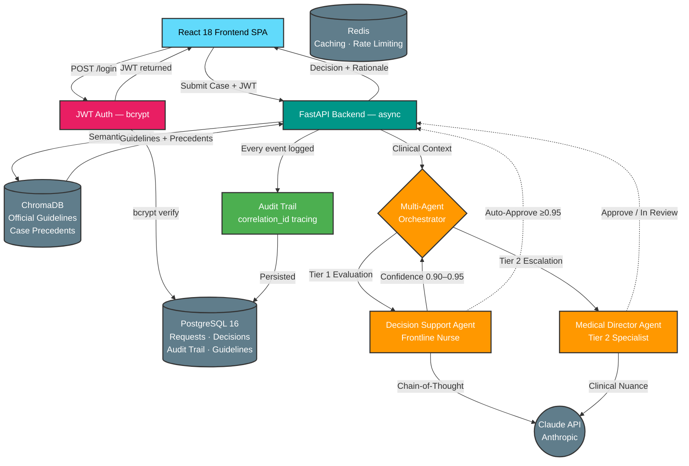

# PACCA — Prior Authorization & Care Coordination Agent Platform

<p align="center">
  <strong>Production-Grade Multi-Agent AI for Healthcare Prior Authorization</strong>
</p>

<p align="center">
  <a href="#architecture">Architecture</a> •
  <a href="#engineering-decisions">Engineering Decisions</a> •
  <a href="#agent-design">Agent Design</a> •
  <a href="#database-strategy">Database Strategy</a> •
  <a href="#quick-start">Quick Start</a> •
  <a href="#api-documentation">API Docs</a>
</p>

<p align="center">
  
  
  
  
  
  
  
</p>

<p align="center">
  <strong>Active development sprint — targeting v2.2.0 production milestone</strong><br/>
  <a href="CHANGELOG.md">CHANGELOG</a> •
  <a href="docs/RELEASE_NOTES_v2.2.md">Release Notes v2.2</a> •
  <a href="docs/ARCHITECTURE.md">Architecture + ADRs</a>
</p>

---

## What This Is

PACCA automates healthcare prior authorization using a hierarchical multi-agent AI system. A provider submits a case; four specialized AI agents evaluate it against real clinical guidelines retrieved via RAG; the system returns an explainable decision with a confidence score and a complete audit trail.

**The market problem it addresses:** Prior authorization costs U.S. healthcare $50–100 billion annually in administrative overhead. Providers spend 34+ hours per week on manual authorization workflows. 29% of delayed authorizations directly impact patient outcomes.

**What makes this technically non-trivial:** The system does not wrap a chat API. It implements deterministic agent contracts, a dual-collection RAG architecture that learns from human overrides without model retraining, a hierarchical escalation tree with clinical trigger conditions, and a full HIPAA-compliant audit trail with correlation-ID-based request tracing.

---

## Architecture



**Key architectural properties:**
- Every agent call is bounded by a `start`/`complete` audit pair — orphaned `start` records identify failure points exactly
- All audit records for one request share a `correlation_id` UUID, making full request traces queryable in one call
- The Orchestrator contains zero clinical reasoning — only workflow logic — so escalation rules are testable independently of LLM calls
- The RAG dual-collection design separates authoritative guidelines from institutional precedents, enabling learning without retraining

---

## Engineering Decisions

These are deliberate architectural choices, not defaults. Each trade-off is documented here because a production system that cannot explain its own design decisions is a liability.

### Decision 1: Custom Agent Framework vs. LangChain / CrewAI

**Chose:** Custom agent base class (`agents/base.py`)

**Rejected:** LangChain, CrewAI, AutoGen

**Rationale:** Healthcare prior authorization requires deterministic escalation logic — specific clinical conditions (experimental treatment, rare ICD-10 codes, prior denial history) must trigger specific routing paths regardless of LLM output. Framework abstractions obscure this control flow and make compliance auditing harder. The custom framework is ~150 lines and gives explicit control over every handoff point. The trade-off is maintenance ownership; the benefit is that every escalation decision is a readable `if` statement, not a framework callback.

### Decision 2: PostgreSQL as Primary Database

**Chose:** PostgreSQL 16 (production) / SQLite (local development)

**Rejected:** MongoDB, DynamoDB, SQLite-only

**Rationale:** The data model has hard relational constraints — a `Decision` must have exactly one `Request`; an `AuditLog` must reference a valid `Request`. These are foreign key relationships, and a relational database enforces them at the database level rather than in application code. PostgreSQL's native `JSONB` type (used for `audit_logs.token_usage`, `audit_logs.details`, `decisions.rationale_data`) enables indexed queries inside JSON fields — for example, finding all decisions where `details->>'confidence_score' < 0.9` for compliance analysis. The `JSONB` column type is already in `db/models.py`; switching from SQLite to PostgreSQL is a single environment variable change (see [Database Strategy](#database-strategy)).

### Decision 3: SQLAlchemy ORM with Repository Pattern

**Chose:** SQLAlchemy 2.0 async ORM + Repository pattern (`db/repository.py`)

**Rejected:** Raw SQL, SQLModel, Tortoise ORM

**Rationale:** The repository pattern (`AuthorizationRepository`, `DecisionRepository`, `AuditRepository`) decouples business logic from database mechanics. Routes call `await audit.log(...)` without knowing whether the underlying store is PostgreSQL or SQLite — the repository handles the translation. This makes unit testing clean (mock the repository, not the database), and makes database engine swaps a configuration change rather than a code change.

### Decision 4: ChromaDB Dual-Collection RAG

**Chose:** Two ChromaDB collections — `nccn_guidelines` (official rules) + `case_precedents` (human overrides)

**Rejected:** Single-collection RAG, Pinecone (SaaS), pure fine-tuning

**Rationale:** Clinical guidelines and institutional precedents have different trust levels and update frequencies. Official guidelines update quarterly; institutional overrides update continuously. Separating them into two collections allows independent versioning, different relevance-weighting in prompts, and rollback of institutional learning without touching the authoritative guideline store. The precedents collection is the system's memory — when a Medical Director overrides an AI decision and records a rationale, that rationale is embedded and stored. Future semantically similar cases retrieve that precedent alongside official guidelines. This achieves institutional learning without model retraining or fine-tuning.

### Decision 5: Async Throughout

**Chose:** Fully async FastAPI + AsyncSession + async agent calls

**Rejected:** Sync FastAPI with threading

**Rationale:** Each prior authorization involves 2–4 Claude API calls, each taking 3–8 seconds. A synchronous server would block the event loop during every API call, making concurrent users mutually exclusive. The async architecture allows FastAPI to handle other requests while the LLM is thinking. Every `await` in the codebase is a point where the server can serve other requests — the difference between 500 concurrent users and 1.

---

## Agent Design

### The Type System (`agents/types.py`)

Every agent interaction is typed end-to-end. The type system is the contract:

```python
# AgentContext — passed to every agent, carries request state and correlation tracking
class AgentContext(BaseModel):
    request_id: str                          # Authorization request being processed
    correlation_id: str                      # Shared UUID across all audit records
    previous_agents: list[AgentType]         # Which agents have already run
    agent_outputs: dict[str, Any]            # Their outputs (available to downstream agents)
    force_escalation: bool                   # Override flag for high-risk cases
    autonomy_level: AgentAutonomyLevel       # SUPERVISED | AUTONOMOUS | LOCKED

# AgentResponse[T] — every agent returns this generic wrapper
class AgentResponse(BaseModel, Generic[T]):
    output: T | None                         # Agent-specific structured output
    confidence_score: float                  # 0.0–1.0
    should_escalate: bool                    # Agent's own escalation recommendation
    escalation_reasons: list[str]            # Why it thinks it should escalate
    token_usage: TokenUsage                  # Input/output tokens + estimated cost
    duration_ms: int                         # Execution time for performance tracking

# TokenUsage — cost tracking built into the type system
class TokenUsage(BaseModel):
    input_tokens: int
    output_tokens: int

    @property
    def estimated_cost(self) -> float:
        # Claude Sonnet pricing: $3/M input, $15/M output
        return (self.input_tokens / 1_000_000 * 3.0) + (self.output_tokens / 1_000_000 * 15.0)
```

### The Base Agent (`agents/base.py`)

The base class enforces a structured output contract using Claude's tool-use API:

```python
# Instead of parsing free-form JSON from LLM output (fragile),
# we define the response schema as a tool input and force the LLM
# to call that tool — making structured output a guarantee, not a hope.
tool_def = {
    "name": "submit_result",
    "input_schema": response_model.model_json_schema()  # Pydantic schema
}
response = await client.messages.create(
    tools=[tool_def],
    tool_choice={"type": "tool", "name": "submit_result"}  # Force tool use
)
```

This pattern eliminates the most common source of agent failures: LLM responses that look like JSON but are not quite valid.

### Escalation Logic (Orchestrator)

The Orchestrator enforces the escalation tree. Each branch is an explicit conditional — not a probabilistic decision:

```
Authorization Request Received
├── Decision Agent (Tier 1 — Frontline Nurse)
│   ├── confidence ≥ 0.95 AND status == AUTO_APPROVED → return immediately
│   ├── 0.90 ≤ confidence < 0.95 → escalate to Tier 2
│   └── confidence < 0.90 → route to human review queue
│
└── Medical Director Agent (Tier 2 — invoked only when Tier 1 is uncertain)
    ├── confidence ≥ 0.95 → AUTO_APPROVED
    └── confidence < 0.95 → IN_REVIEW (human queue)
```

> **All 7 escalation branches are implemented.** Pre-flight checks (Branches 4-7) run before any LLM call and route cases directly to human review based on deterministic clinical policy rules. Post-agent checks (Branches 1-3) evaluate Decision Agent confidence. See `agents/clinical_risk_detector.py` and `tests/unit/test_escalation_tree.py` for the full implementation and one test per branch.

### The Policy Evolution Agent (`agents/evolution.py`)

The Level 5 architecture introduces a `PolicyEvolutionAgent` — an agent that rewrites clinical authorization guidelines based on accumulated human override patterns. When a Medical Director consistently approves exceptions to a strict guideline, the Evolution Agent can propose a revised guideline that incorporates that exception. Proposals require human approval before deployment (see `api/routes/admin.py`).

This is the system's long-term learning mechanism: not fine-tuning, not prompt injection, but structured policy evolution with a human approval gate and a full version trail in the database.

---

## Database Strategy

### Development vs. Production

PACCA uses a single codebase for both environments. The database engine is swapped via one environment variable:

```bash
# Local development — SQLite, zero configuration required
DATABASE_URL=sqlite+aiosqlite:///./pacca.db

# Production — PostgreSQL 16, full feature set
DATABASE_URL=postgresql+asyncpg://pacca:password@db:5432/pacca
```

This works because the entire data layer uses SQLAlchemy 2.0 ORM with no raw SQL. The ORM translates Python to the correct SQL dialect automatically. The repository pattern (`db/repository.py`) means no route or agent touches a database engine directly.

### Why PostgreSQL in Production

The code is already written for PostgreSQL. Specifically:

**Native JSONB columns** — `db/models.py` imports `from sqlalchemy.dialects.postgresql import JSONB` for audit log details, token usage, and decision rationale. SQLite silently stores these as TEXT, which works for local development but loses the ability to run JSON-path queries against audit records. In production, you can query: *"find all authorizations where the decision agent's confidence was below 0.85 for oncology cases in Q4"* — that requires JSONB.

**Concurrent write safety** — SQLite serializes all writes through a single file lock. PostgreSQL uses row-level locking and MVCC (Multi-Version Concurrency Control), allowing hundreds of concurrent authorization requests to write simultaneously.

**Connection pooling** — The async engine (`db/session.py`) is configured for PostgreSQL's connection pool: `pool_size`, `max_overflow`, `pool_timeout`, `pool_pre_ping`. These settings are no-ops on SQLite but activate automatically when the DATABASE_URL points to PostgreSQL.

**High availability** — PostgreSQL supports streaming replication, point-in-time recovery, and logical replication. For a healthcare audit trail, losing `pacca.db` due to disk failure is a HIPAA incident. PostgreSQL on managed infrastructure (AWS RDS, Google Cloud SQL) provides automated backups and failover.

### Schema Highlights

```python
# AuditLogModel — the core HIPAA compliance artifact
class AuditLogModel(Base):
    entry_id: str          # UUID7 — time-sortable, globally unique
    correlation_id: str    # Shared UUID across all records for one request
    action: str            # "authorization_submitted" | "agent_decision_completed" | ...
    actor: str             # Provider NPI, agent name, or "system"
    actor_type: str        # "provider" | "agent" | "user" | "system"
    duration_ms: int       # How long this action took
    token_usage: JSONB     # {input_tokens, output_tokens} — cost tracking
    details: JSONB         # Action-specific structured data
    success: bool          # False = this record is a failure event
    error_message: str     # Populated when success=False
```

Every authorization submission generates 4–7 audit records (submission, per-agent start/complete, escalation decision, final decision). All share the same `correlation_id`. A compliance query for a single authorization retrieves the complete chain.

---

## Quick Start

### Option 1: Docker (Full Stack — Recommended)

Starts the API, PostgreSQL 16, Redis, and ChromaDB in one command:

```bash
git clone https://github.com/Chaos-6/pacca.git
cd pacca

cp .env.example .env
# Edit .env — set ANTHROPIC_API_KEY and change SECRET_KEY

docker-compose up -d

# Services:
# PACCA API + Swagger docs:  http://localhost:8000/docs
# Langfuse observability UI: http://localhost:3001
#   Login: admin@pacca.local / pacca_admin_dev
#   Traces appear automatically after the first authorization request
# ChromaDB:                  http://localhost:8001
# PostgreSQL (PACCA):        localhost:5432
# PostgreSQL (Langfuse):     localhost:5433
```

### Option 2: Local Development (SQLite, zero config)

```bash
git clone https://github.com/Chaos-6/pacca.git
cd pacca

python -m venv venv && source venv/bin/activate
pip install -e ".[dev]"

cp .env.example .env
# Set ANTHROPIC_API_KEY and DATABASE_URL (see .env.example)

# Initialize database tables
python -c "import asyncio; from pacca.db.session import init_database; asyncio.run(init_database())"

# Seed sample clinical guidelines into ChromaDB
python seed_data.py

# Start API
uvicorn pacca.api.main:app --reload --port 8000

# In a second terminal, start the React frontend
cd frontend && npm install && npm run dev
```

### Running Tests

```bash
# Full test suite
pytest

# Unit tests only (fast, no API calls)
pytest tests/unit -v

# With coverage report
pytest tests/unit --cov=pacca --cov-report=html

# Audit trail tests specifically
pytest tests/unit/test_audit_trail.py -v
```

---

## API Reference

### Core Endpoints

| Method | Endpoint | Auth | Description |
|--------|----------|------|-------------|
| `POST` | `/api/v1/login/` | None | Exchange credentials for JWT |
| `POST` | `/api/v1/authorizations/` | JWT | Submit new authorization request |
| `GET` | `/api/v1/authorizations/` | JWT | List requests with pagination |
| `GET` | `/api/v1/authorizations/{id}` | JWT | Get request + decision detail |
| `POST` | `/api/v1/authorizations/feedback` | JWT | Submit human override (learning loop) |
| `GET` | `/api/v1/admin/config` | JWT | Read current operational configuration |
| `PATCH` | `/api/v1/admin/config` | JWT | Update config at runtime (no restart) |
| `DELETE` | `/api/v1/admin/config/overrides` | JWT | Reset all runtime overrides to env defaults |
| `GET` | `/api/v1/admin/metrics` | JWT | Operational metrics + Langfuse link |
| `POST` | `/api/v1/admin/optimize_policies` | JWT | Trigger Level 5 policy evolution |
| `GET` | `/health` | None | Health check |

Full interactive documentation: `http://localhost:8000/docs` (Swagger UI) or `http://localhost:8000/redoc`

### Example: Submit Authorization

```bash
curl -X POST http://localhost:8000/api/v1/authorizations/ \
  -H "Authorization: Bearer <your-jwt>" \
  -H "Content-Type: application/json" \
  -d '{
    "request_id": "AUTH-001",
    "patient_id": "P-12345",
    "provider_npi": "1234567890",
    "clinical_case": {
      "patient_id": "P-12345",
      "primary_diagnosis_code": "C34.1",
      "procedure_code": "J9271",
      "evidence": [{
        "id": "e1",
        "source_type": "CLINICAL_NOTE",
        "description": "Stage IIIA NSCLC, PD-L1 TPS ≥50%, prior platinum-based chemo",
        "original_text": "Patient is a 58-year-old male with stage IIIA non-small cell lung cancer...",
        "confidence": 0.95
      }]
    }
  }'
```

```json
{
  "decision_id": "DEC-01HQXYZ...",
  "status": "AUTO_APPROVED",
  "confidence_score": 0.97,
  "rationale": "NCCN Category 1 recommendation supports Pembrolizumab monotherapy for PD-L1 TPS ≥50% NSCLC without EGFR/ALK alterations. All criteria documented.",
  "review_tier_used": "AUTOMATED",
  "timestamp": "2026-04-04T10:23:41.123Z"
}
```

---

## Project Structure

```
pacca/
├── src/pacca/
│   ├── agents/
│   │   ├── base.py              # ABC + tool-use structured output pattern
│   │   ├── types.py             # AgentContext, AgentResponse[T], TokenUsage, ToolCall
│   │   ├── orchestrator.py      # Escalation logic + per-agent audit records
│   │   ├── decision.py          # Decision + Medical Director agents
│   │   ├── evidence_agent.py    # Evidence aggregation (EHR synthesis)
│   │   ├── classification_agent.py  # Complexity scoring + routing
│   │   ├── evolution.py         # Level 5: Policy Evolution Agent
│   │   └── prompts/
│   │       └── templates.py     # Structured prompt templates (reusable safety components)
│   ├── api/
│   │   ├── main.py              # FastAPI app, CORS, auth endpoints
│   │   └── routes/
│   │       ├── authorizations.py  # Core workflow + audit wiring
│   │       ├── admin.py         # Policy evolution management
│   │       └── health.py        # Health + readiness probes
│   ├── db/
│   │   ├── models.py            # SQLAlchemy ORM (PostgreSQL JSONB columns)
│   │   ├── repository.py        # Repository pattern — AuthorizationRepository,
│   │   │                        #   DecisionRepository, AuditRepository
│   │   ├── session.py           # Async engine + session factory (pool configured)
│   │   └── migrations/          # Alembic schema migrations
│   ├── rag/
│   │   ├── pipeline.py          # RAGPipeline — cosine scoring, metadata filtering
│   │   └── sample_guidelines.py # Seed data: NCCN, CMS, AHA guidelines
│   ├── integrations/
│   │   └── vector_store.py      # GuidelineRetriever — dual-collection ChromaDB
│   ├── models/                  # Pydantic domain models
│   └── config/                  # Settings + structlog logging
├── tests/
│   ├── unit/
│   │   ├── test_api.py          # HTTP endpoint tests
│   │   ├── test_models.py       # Domain model tests (edge cases)
│   │   └── test_audit_trail.py  # Audit wiring tests (correlation_id, failure logging)
│   ├── integration/             # (In progress — Week 4)
│   └── clinical/                # (In progress — Week 4: golden dataset + LLM-as-judge)
├── docs/
│   └── ARCHITECTURE.md          # Detailed component documentation
├── docker-compose.yml           # PostgreSQL 16 + Redis + ChromaDB + API
├── Dockerfile                   # Multi-stage build (builder → production → development)
├── pyproject.toml               # ruff + mypy strict + pytest asyncio + coverage 80%
└── .env.example                 # Documented environment variables
```

---

## Technology Stack

| Layer | Technology | Notes |
|-------|------------|-------|
| **LLM** | Claude (Anthropic API) | Tool-use forced for structured output |
| **Backend** | Python 3.12, FastAPI, Pydantic v2 | Fully async throughout |
| **Production DB** | PostgreSQL 16, SQLAlchemy 2.0, Alembic | JSONB columns, async engine, connection pool |
| **Dev DB** | SQLite (same ORM layer) | One env var to switch to PostgreSQL |
| **Vector Store** | ChromaDB | Dual-collection: official guidelines + precedents |
| **Cache** | Redis 7 | Rate limiting, session caching |
| **Frontend** | React 18, TypeScript, Tailwind CSS, Vite | |
| **Testing** | pytest, pytest-asyncio, hypothesis | fail_under=80, asyncio_mode=auto |
| **Code Quality** | ruff, mypy (strict), pre-commit | Zero type-ignore pragmas in core modules |
| **CI/CD** | GitHub Actions | Lint → Test → Coverage → Docker build |
| **Containerization** | Docker, Docker Compose | Multi-stage build, non-root user |

---

## Clinical Demo Scenarios

Three pre-configured cases exercise different decision paths. Load them via the "Load Demo Data" button in the frontend.

**Scenario 1 — Routine Imaging (Auto-Approve)**
Case: MRI lumbar spine, chronic low back pain, documented conservative treatment failure.
Expected: `AUTO_APPROVED`, confidence > 0.90. Demonstrates: guideline retrieval, autonomous decision path.

**Scenario 2 — Oncology Immunotherapy (Tier 2 Escalation)**
Case: Pembrolizumab for Stage IIIA NSCLC, PD-L1 ≥50%, estimated cost $15,000/cycle.
Expected: Decision Agent is confident; Medical Director invoked due to high-cost threshold ($100K+ annual projection).
Demonstrates: Tier 2 escalation, cost-threshold routing, multi-agent coordination.

**Scenario 3 — Incomplete Documentation (Human Review)**
Case: Biologic therapy with missing lab results and insufficient prior treatment documentation.
Expected: `IN_REVIEW`. Agent identifies specific missing elements.
Demonstrates: Evidence gap detection, human-in-the-loop routing, conditional response pattern.

---

## Configuration Reference

```bash
# ── Required ─────────────────────────────────────────────────────────────────
ANTHROPIC_API_KEY=sk-ant-...          # Claude API key
SECRET_KEY=<min-32-char-random>       # JWT signing key — NEVER commit a real value

# ── Database (switch one line to go from dev to production) ──────────────────
DATABASE_URL=sqlite+aiosqlite:///./pacca.db           # Local development
# DATABASE_URL=postgresql+asyncpg://pacca:pw@db:5432/pacca  # Production

# ── Clinical Decision Thresholds ─────────────────────────────────────────────
AUTO_APPROVE_CONFIDENCE_THRESHOLD=0.95   # ≥ this → automatic approval
ESCALATION_CONFIDENCE_THRESHOLD=0.90    # < this but ≥ 0.90 → Medical Director
HIGH_COST_THRESHOLD=100000              # $ above this → Medical Director review
COMPLEXITY_AUTO_APPROVE_MAX=2           # Complexity 1-2 eligible for autonomous decision

# ── Feature Flags ────────────────────────────────────────────────────────────
ENABLE_AUTONOMOUS_DECISIONS=true         # false → all cases require human review
ENABLE_RAG=true                          # false → decisions without guideline context
DEMO_MODE=true                           # Loads sample cases and demo accounts
```

See [.env.example](.env.example) for the complete annotated reference.

---

## Compliance Notes

PACCA is designed with HIPAA Security Rule 164.312(b) audit control requirements in mind:

- Every request touching PHI writes an audit record before any processing begins
- Every agent execution writes `start` + `complete` records — orphaned `start` records identify exact failure points
- All audit records for one request share a `correlation_id` UUID for complete trace reconstruction
- Human overrides (the learning loop) write a `precedent_learned` audit record including who submitted the override and when
- The `AuditLogModel.success=False` field distinguishes failure events from normal events without requiring log parsing

**This is not a HIPAA-certified product.** It is a portfolio demonstration of HIPAA-conscious architecture patterns. A production deployment would require a HIPAA Business Associate Agreement with Anthropic, encryption at rest for the PostgreSQL instance, TLS for all connections, and a formal risk assessment.

---

## License

MIT License — see [LICENSE](LICENSE)

---

<p align="center">
  Built by <strong>David Reed</strong> — PhD, MBA, PMP | Head of Career Advancement & AI/ML Delivery, Interview Kickstart<br>
  <em>Demonstrating production-grade agentic AI architecture for healthcare workflows</em>
</p>
