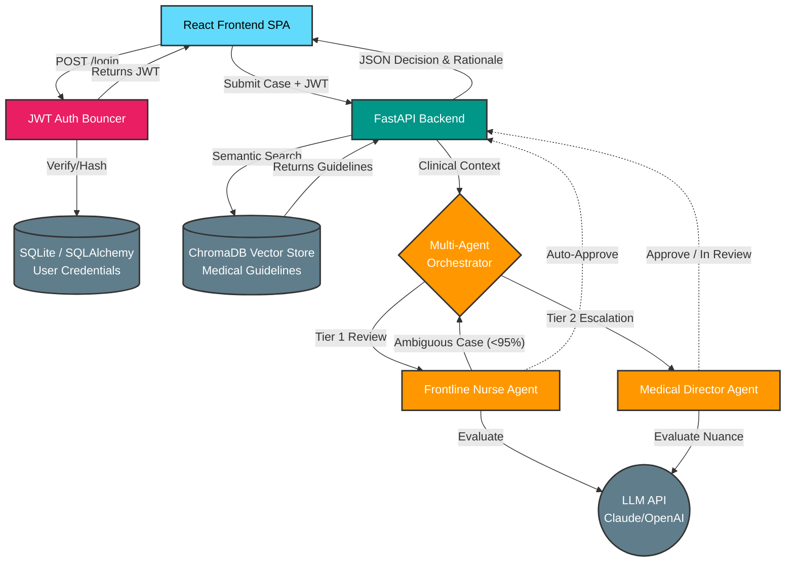

# PACCA - Prior Authorization & Care Coordination Agent Platform

<p align="center">
  <strong>AI-Powered Healthcare Prior Authorization Platform</strong>
</p>

<p align="center">
  <a href="#features">Features</a> •
  <a href="#architecture">Architecture</a> •
  <a href="#quick-start">Quick Start</a> •
  <a href="#api-documentation">API Docs</a> •
  <a href="#demo-scenarios">Demo</a>
</p>

<p align="center">
  
  
  
  
  
</p>

---

## Overview

PACCA is a **secure, multi-agent AI workflow** designed to automate healthcare prior authorization reviews. It solves one of healthcare's biggest bottlenecks by combining the reasoning capabilities of Large Language Models (LLMs) with strict, deterministic grading rubrics and local vector databases. 

Unlike basic "ChatGPT wrappers," PACCA grounds every decision in factual medical guidelines using Retrieval-Augmented Generation (RAG) and features built-in escalation routing to mimic a real-world hospital administration hierarchy.

### The Problem

Prior authorization is a significant pain point in healthcare:
- **Providers** spend 34+ hours/week on prior authorizations
- **Patients** face treatment delays averaging 2-3 days
- **Payers** process millions of requests manually
- **Errors** lead to inappropriate denials and appeals

### The Solution

PACCA automates the prior authorization workflow using a multi-agent architecture:

1. **Evidence Aggregation** - Gathers and synthesizes clinical data
2. **Clinical Classification** - Assesses complexity and routes appropriately
3. **Decision Support** - Evaluates against guidelines with explainable reasoning
4. **Human-in-the-Loop** - Escalates complex cases for human review
5. **Secure Access** - JWT-authenticated provider dashboard.
6. **Contextual Retrieval** - Instantly fetches relevant CPT/ICD-10 guidelines via vector embeddings.
7. **Chain-of-Thought Reasoning** - AI evaluates clinical notes step-by-step against strict criteria.
8. **Hierarchical Escalation** - Frontline AI handles routine cases; complex cases are routed to a specialized Medical Director AI or flagged for human review.
9. **Institutional Memory** - The system learns from human overrides, saving past precedents to the vector database to guide future decisions.
---

## Features

### 🤖 Multi-Agent AI System
- **Evidence Aggregation Agent**: Synthesizes clinical data into coherent narratives
- **Classification Agent**: Complexity scoring, specialty routing, urgency assessment
- **Decision Support Agent**: Guideline-based recommendations with chain-of-thought reasoning
- **Orchestration Agent**: Workflow coordination and escalation logic

### 📋 Clinical Decision Support
- RAG-powered guideline retrieval using ChromaDB
- Evidence-based recommendations with confidence scores
- Transparent decision rationale for explainability
- Support for step therapy and prior treatment requirements

### 👥 Human Oversight
- Configurable confidence thresholds for autonomous decisions
- Automatic escalation for complex/high-risk cases
- Human review interface with AI-generated summaries
- Complete audit trail for compliance

### 📚 RAG & Institutional Memory
- **ChromaDB Vector Store:** Houses thousands of medical guidelines (e.g., CMS, NCCN) for semantic search.
- **Dual-Collection Strategy:** Maintains one database for rigid "Official Rules" and a second for "Case Precedents" (human overrides), allowing the AI to learn dynamically without code changes.

### 🤖 Multi-Agent Orchestration
- **Decision Support Agent (Frontline Nurse):** Evaluates clear-cut cases. Capable of auto-approving if strict confidence thresholds (>= 95%) are met.
- **Medical Director Agent (Specialist):** Steps in when the frontline agent is unsure. Evaluates clinical nuance and gray areas before routing to a human queue.
- **Deterministic Prompting:** Agents utilize persona-based, Chain-of-Thought prompting to prevent hallucinations and enforce strict compliance.

### 🔐 Secure Full-Stack Architecture
- **JWT Authentication:** End-to-end secured endpoints using `bcrypt` password hashing and stateless JSON Web Tokens.
- **Relational Database:** Local SQLite database managed via **SQLAlchemy ORM** for provider and user credential management.
- **Modern Frontend:** Responsive React 18 Provider Dashboard built with Vite and Tailwind CSS.

### 🔧 Production-Ready Architecture
- FastAPI backend with async support
- React frontend with real-time updates
- PostgreSQL for persistence, Redis for caching
- Docker and Kubernetes ready
- Comprehensive test coverage

## Architecture



---
For detailed architecture documentation, see [docs/ARCHITECTURE.md](docs/ARCHITECTURE.md).

## Quick Start

### Prerequisites

- Python 3.12+
- Node.js 18+ (for frontend)
- Docker & Docker Compose (optional)
- Anthropic API key

### Option 1: Docker (Recommended)

```bash
# Clone the repository
git clone https://github.com/yourusername/pacca.git
cd pacca

# Set up environment
cp .env.example .env
# Edit .env and add your ANTHROPIC_API_KEY

# Start all services
docker-compose up -d

# Access the application
# Frontend: http://localhost:3000
# API: http://localhost:8000
# API Docs: http://localhost:8000/docs
```

### Option 2: Local Development

```bash
# Clone and setup
git clone https://github.com/yourusername/pacca.git
cd pacca

# Create virtual environment
python -m venv venv
source venv/bin/activate  # or `venv\Scripts\activate` on Windows

# Install dependencies
pip install -e ".[dev]"

# Set environment variables
export ANTHROPIC_API_KEY=sk-ant-your-key-here
export DATABASE_URL=sqlite+aiosqlite:///./pacca.db

# Initialize database
python -c "import asyncio; from pacca.db import init_database; asyncio.run(init_database())"

# Start the API server
uvicorn pacca.api.main:app --reload

# In another terminal, start the frontend
cd frontend
npm install
npm run dev
```

### Running Tests

```bash
# Run all tests
pytest

# Run with coverage
pytest --cov=pacca --cov-report=html

# Run specific test categories
pytest tests/unit
pytest tests/integration
```

---

## API Documentation

### Submit Authorization Request

```http
POST /api/v1/authorizations
Content-Type: application/json

{
  "patient": {
    "id": "P12345",
    "date_of_birth": "1966-05-15",
    "gender": "M"
  },
  "diagnosis": {
    "code": "C34.1",
    "description": "Malignant neoplasm of upper lobe, bronchus or lung"
  },
  "treatment": {
    "code": "J9271",
    "code_type": "HCPCS",
    "description": "Pembrolizumab injection",
    "category": "medication",
    "estimated_cost": 15000.00
  },
  "provider": {
    "provider_id": "1234567890",
    "provider_name": "Dr. Jane Smith"
  },
  "payer": {
    "payer_id": "BCBS001",
    "payer_name": "Blue Cross Blue Shield",
    "member_id": "MEM123456"
  },
  "clinical_notes": "Patient with stage IIIA NSCLC, PD-L1 TPS ≥50%...",
  "urgency": "expedited"
}
```

### Response

```json
{
  "request_id": "AUTH-01HQXYZ...",
  "status": "approved",
  "decision": "approve",
  "confidence_score": 0.92,
  "decision_summary": "Authorization approved based on NCCN guidelines...",
  "complexity": 3,
  "specialty": "oncology",
  "requires_human_review": false
}
```

### Additional Endpoints

| Method | Endpoint | Description |
|--------|----------|-------------|
| GET | `/api/v1/authorizations` | List authorizations with pagination |
| GET | `/api/v1/authorizations/{id}` | Get authorization details |
| GET | `/api/v1/authorizations/{id}/explain` | Get decision explanation |
| POST | `/api/v1/authorizations/{id}/review` | Submit human review |
| GET | `/api/v1/metrics` | System metrics |
| GET | `/health` | Health check |

Full API documentation available at `/docs` when running the server.

---

## Demo Scenarios

PACCA includes pre-configured clinical scenarios for demonstration:

### 1. Routine Imaging (Auto-Approve Path)
- **Case**: MRI lumbar spine for chronic low back pain
- **Expected**: High confidence approval (>90%)
- **Outcome**: Autonomous approval

### 2. Oncology Immunotherapy (Review Path)
- **Case**: Pembrolizumab for Stage IIIA NSCLC with PD-L1 ≥50%
- **Expected**: Moderate complexity, guideline-aligned
- **Outcome**: Approval with human review (high cost)

### 3. Incomplete Documentation (Request More Info)
- **Case**: Biologic therapy with missing lab work
- **Expected**: Insufficient evidence
- **Outcome**: Request for additional documentation

Load demo data in the frontend using the "Load Demo Data" button.

---

## Configuration

### Environment Variables

| Variable | Description | Default |
|----------|-------------|---------|
| `ANTHROPIC_API_KEY` | Claude API key | Required |
| `DATABASE_URL` | Database connection string | SQLite (local) |
| `REDIS_URL` | Redis connection string | localhost:6379 |
| `APP_ENV` | Environment (development/production) | development |
| `AUTO_APPROVE_CONFIDENCE_THRESHOLD` | Confidence for autonomous approval | 0.85 |
| `ESCALATION_CONFIDENCE_THRESHOLD` | Confidence below which to escalate | 0.75 |
| `COMPLEXITY_AUTO_APPROVE_MAX` | Max complexity for auto-approval | 2 |
| `HIGH_COST_THRESHOLD` | Cost threshold for medical director review | 100000 |

See [.env.example](.env.example) for all configuration options.

---

## Project Structure

```
pacca/
├── src/pacca/
│   ├── agents/           # Multi-agent framework
│   │   ├── base.py       # Base agent class
│   │   ├── evidence_agent.py
│   │   ├── classification_agent.py
│   │   ├── decision_agent.py
│   │   ├── orchestrator.py
│   │   └── prompts/      # Agent prompt templates
│   ├── api/              # FastAPI application
│   │   ├── main.py
│   │   └── routes/
│   ├── config/           # Settings and logging
│   ├── db/               # Database layer
│   │   ├── models.py     # SQLAlchemy models
│   │   ├── repository.py # Repository pattern
│   │   └── migrations/   # Alembic migrations
│   ├── models/           # Pydantic domain models
│   └── rag/              # RAG pipeline
│       ├── pipeline.py
│       └── sample_guidelines.py
├── frontend/             # React frontend
├── tests/                # Test suites
├── demo/                 # Demo scenarios
├── docs/                 # Documentation
└── docker-compose.yml    # Docker orchestration
```

---

## Technology Stack

| Layer | Technology |
|-------|------------|
| **LLM** | Claude (Anthropic API) |
| **Backend** | Python 3.12, FastAPI, Pydantic v2 |
| **Database** | PostgreSQL, SQLAlchemy 2.0, Alembic |
| **Vector Store** | ChromaDB |
| **Cache** | Redis |
| **Frontend** | React 18, TypeScript, Tailwind CSS |
| **Testing** | pytest, pytest-asyncio |
| **CI/CD** | GitHub Actions |
| **Containerization** | Docker, Docker Compose |

---

## Contributing

Contributions are welcome! Please read our contributing guidelines and submit pull requests.

1. Fork the repository
2. Create a feature branch (`git checkout -b feature/amazing-feature`)
3. Commit your changes (`git commit -m 'Add amazing feature'`)
4. Push to the branch (`git push origin feature/amazing-feature`)
5. Open a Pull Request

---

## License

This project is licensed under the MIT License - see the [LICENSE](LICENSE) file for details.

---

## Acknowledgments

- Built with [Claude](https://anthropic.com) by Anthropic
- Inspired by real-world healthcare prior authorization challenges
- Clinical guidelines based on publicly available NCCN, ACR, and AHA guidelines

---

<p align="center">
  <strong>PACCA</strong> - Transforming Prior Authorization with AI
</p>
