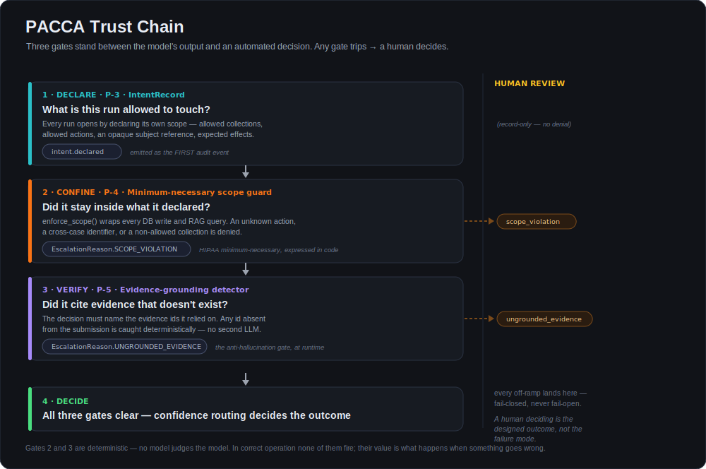
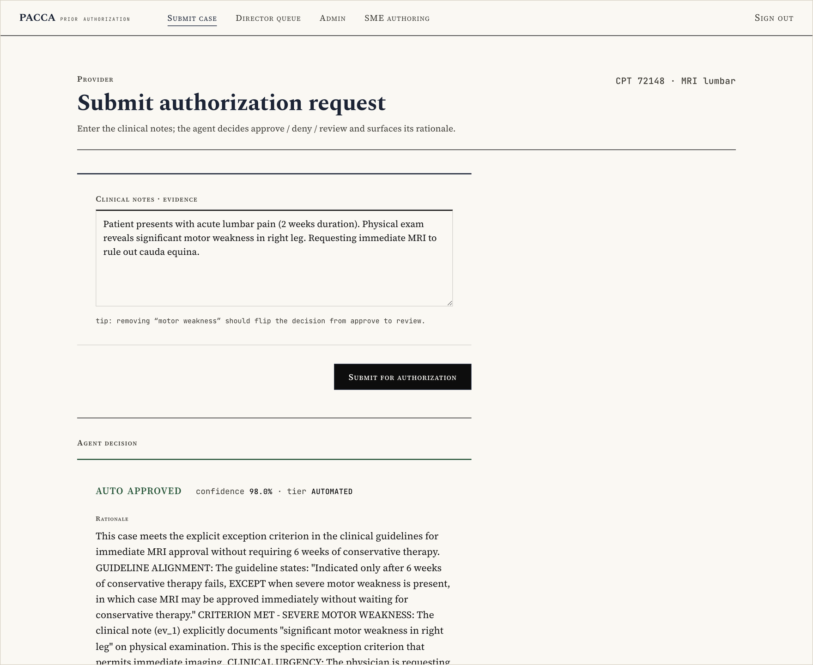
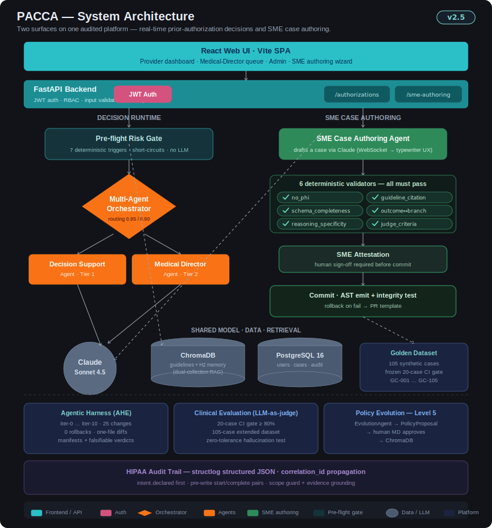
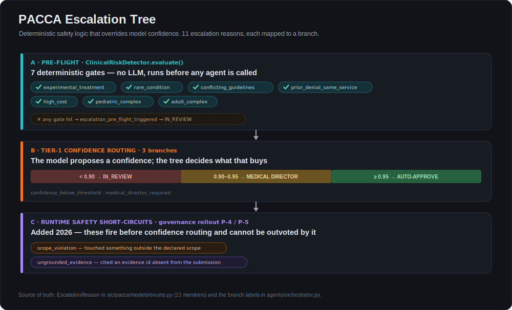
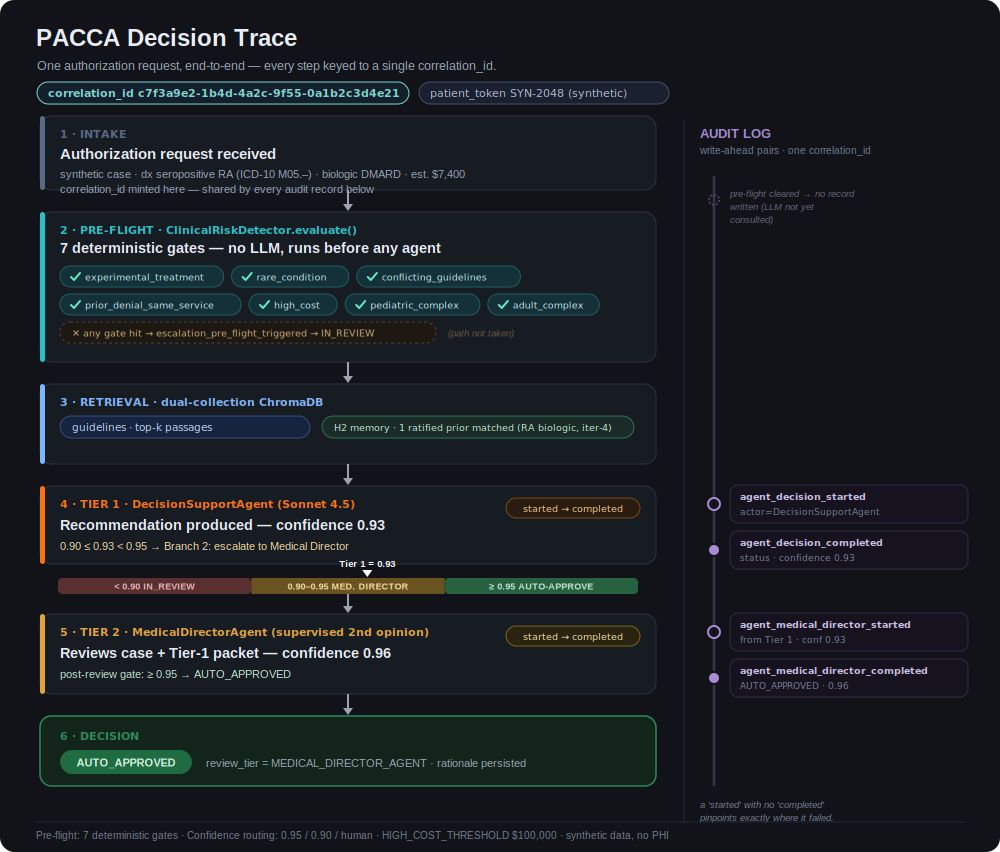
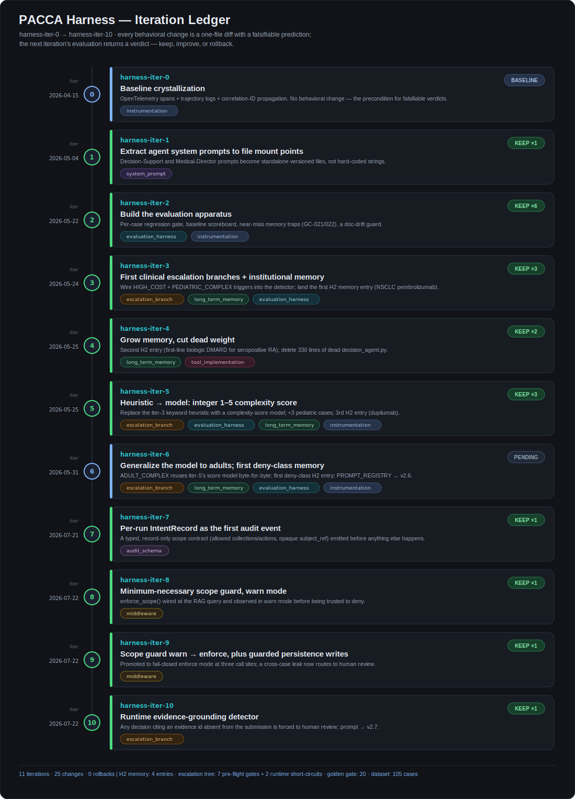
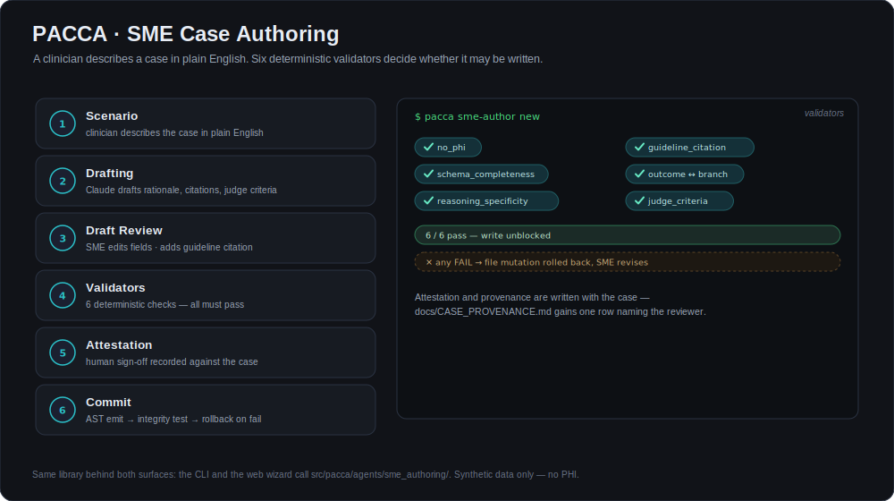

# PACCA — Prior Authorization & Care Coordination Agent Platform

**A multi-agent AI system that decides healthcare prior-authorization requests — and is built so you can prove what it did, and why.**

[](https://github.com/drdgreed/pacca/actions/workflows/ci.yml)
[](https://www.python.org/)
[](https://anthropic.com/)
[](#portfolio-disclaimer)
[](LICENSE)

<p align="center">
  
</p>

---

## What this is, in 30 seconds

Prior authorization is the process where a doctor must get an insurer's permission before treating a patient. It is slow, expensive, and largely manual. PACCA automates the review using a team of AI agents.

The hard part isn't getting an AI to produce an answer. The hard part is **being able to defend that answer afterward** — to a patient, an auditor, or a regulator. So PACCA is built around one stance:

> The AI is never trusted on its own. Three deterministic checks — ordinary code, no second AI — sit between the model's output and any automated decision. If any of them trips, a human decides instead.

That's the diagram above. It is the point of the project.

Here is the result — a real decision, produced by the running system on a synthetic case. The agent approved it, reported 98% confidence, and cited the specific guideline exception and the specific piece of evidence (`ev_1`) it relied on:

<p align="center">
  
</p>

**Who built it.** I'm David Reed — 35+ years in enterprise AI/ML, formerly Head of AI/ML & Agentic Delivery at Interview Kickstart, Master Technologist at HP, Principal TPM-AI at Microsoft. I built PACCA to demonstrate end-to-end agentic engineering in a domain where being *approximately right* isn't acceptable. [More ↓](#about-the-author)

---

## Portfolio disclaimer

PACCA is a **pre-production portfolio project**. It is **not HIPAA-validated**, has **no Business Associate Agreements** in place, and **must not be used with real patient data**. Every clinical case here is synthetic, and a pre-commit guard actively blocks patient-data-shaped strings from being committed.

The *engineering* is production-grade. The *deployment* is not. Treat this as a reference architecture, not a turnkey product. What would close the gap is written down honestly in [`docs/PACCA_PRD_v2.5_Consolidated.md` §16](docs/PACCA_PRD_v2.5_Consolidated.md) and [`docs/HIPAA_COMPLIANCE.md`](docs/HIPAA_COMPLIANCE.md).

---

## The problem

| Who | What it costs them |
|---|---|
| **Providers** | 34+ hours per practice per week on prior-authorization paperwork |
| **Patients** | 2–3 day treatment delays; 29% of delays directly harm care |
| **Payers** | 200M+ requests a year, mostly reviewed by hand |
| **Reviewers** | Outdated guidelines used in 35% of cases; decision quality varies 18–35% between individuals |

A $50–100B annual administrative burden in the U.S. — and fundamentally a *read-the-documents, apply-the-rules* problem, which is exactly what language models are good at. The obstacle was never capability. It was accountability.

---

## How it works

Five agents, each with one job, coordinated by an orchestrator that holds the safety logic.

<p align="center">
  
</p>

1. **Evidence Aggregation** — turns scattered clinical notes into one coherent narrative
2. **Clinical Classification** — scores complexity, routes by specialty, assesses urgency
3. **Decision Support (Tier 1)** — recommends against retrieved clinical guidelines
4. **Medical Director (Tier 2)** — a supervising second opinion on borderline cases
5. **Policy Evolution** — proposes guideline amendments from human-override patterns, and cannot deploy one without a human Medical Director approving it

### The safety logic overrides the AI

A language model reports its own confidence. Treating that number as authority is the most common way agentic systems fail in production. PACCA doesn't.

<p align="center">
  
</p>

Seven **pre-flight** gates run *before* any AI is invoked — experimental treatment, rare condition, conflicting guidelines, prior denial, high cost, pediatric complexity, adult complexity. Any hit sends the case to a human immediately. Only then does confidence routing decide what the model's own number is worth. Then two runtime guards get the last word.

Eleven escalation reasons in total, each a named value in code, each queryable in the audit log. *"Why was this case escalated?"* always has an exact answer.

---

## Follow one request, end to end

Every step of a decision shares one `correlation_id`, so the entire life of a request is retrievable with a single query — including the steps where nothing went wrong.

<p align="center">
  
</p>

Audit records are written in **start/complete pairs, flushed before the state change they describe**. A `started` with no matching `completed` pinpoints exactly where a failure happened — the property you actually need at 2 a.m., and the one that disappears if you log after the fact.

---

## Built as an experiment log, not a pile of commits

Every change to how an agent reasons ships as a **one-file diff with a written, falsifiable prediction**. The next evaluation round checks that prediction and records a verdict: keep, improve, or roll back. Nothing survives because it felt better.

<p align="center">
  
</p>

**11 iterations · 25 changes · 0 rollbacks.** The method is adapted from Lin et al., *Agentic Harness Engineering* ([arXiv:2604.25850](https://arxiv.org/abs/2604.25850), 2026). Full reasoning, per-change manifests, and the verdict cycle are in **[ENGINEERING.md](docs/ENGINEERING.md)**.

> **Governance context.** PACCA is a Class 2/3 enterprise agent inside a [**CRISP-AG**](https://drdavidreed.com/portfolio)-style governance envelope — an artifact-centered framework for enterprise agentic AI governance that sits beneath ISO/IEC 42001 and NIST AI RMF. The harness discipline here is a concrete instance of CRISP-AG's *Orchestration Contract*; the escalation tree and Medical Director gate instantiate *Delegation Authority Scoping* applied to healthcare.

---

## What's actually measured

Everything below is measured locally or explicitly labeled a benchmark on synthetic cases. This repository contains no real patient data, so nothing here comes from production traffic.

| Metric | Value | How it's known |
|---|---|---|
| **Automated tests** | **710** collected (652 unit · 28 clinical · 27 harness · 3 flow) | `pytest tests/ --collect-only` |
| **Clinical evaluation dataset** | 105 synthetic cases (GC-001–GC-105) across ~20 specialty suites | `tests/clinical/` |
| **Clinical accuracy gate** | 20-case golden core, LLM-as-judge (1–5 rubric), threshold ≥80% — **20/20 at mean 4.9/5**, zero variance across repeat runs | `make test-clinical` |
| **Hallucination tolerance** | **Zero.** Two sparse-notes traps (GC-018, GC-019) fail on any invented clinical fact | clinical gate + runtime detector |
| **Harness iterations** | 11 recorded · 25 changes · 0 rollbacks | `harness/manifests/` |
| **Median decision latency** *(benchmark)* | ~2.1 s | 53-case synthetic run, Sonnet 4.5 |
| **95th-percentile latency** *(benchmark)* | ~4.3 s | same |
| **Cost per decision** *(estimated)* | ~$0.04 | token-counted per case |

**Not yet measured, and I won't imply otherwise:** sustained-load latency, real cost at production volume, and adversarial prompt-injection resistance. Those are open items tracked in [`docs/EVALUATION.md`](docs/EVALUATION.md).

---

## Letting clinicians write the test cases

An evaluation dataset is only as good as the clinical judgment inside it — and that judgment lives with clinicians, not engineers. Authoring one case used to cost an engineer 60–90 minutes of translating medical knowledge into Python.

<p align="center">
  
</p>

A clinician now describes the scenario in plain English and attests to their review. Six deterministic validators — including a patient-data scan and a guideline-citation check — must all pass before anything is written, and any integrity failure rolls the change back automatically. Available as both a CLI and a browser wizard, sharing one library.

---

## Quick start

**Prerequisites:** Python 3.12+, Node 18+, an Anthropic API key. Docker optional.

```bash
git clone https://github.com/drdgreed/pacca.git
cd pacca

python -m venv .venv && source .venv/bin/activate
pip install -e ".[dev]"
cd frontend && npm install && cd ..

export ANTHROPIC_API_KEY=sk-ant-your-key-here
export DATABASE_URL=sqlite+aiosqlite:///./pacca.db
export SECRET_KEY=$(python -c 'import secrets; print(secrets.token_urlsafe(48))')
export CORS_ORIGINS=http://localhost:3000

make sme-author-web        # backend on :8000, frontend on :3000
```

Then open <http://localhost:3000/login>. There is no default admin account by design — register the first user via `/admin` or `POST /api/v1/register/`.

**Backing services via Docker** (API, PostgreSQL, Redis, ChromaDB, Langfuse — the frontend runs from npm, not Compose):

```bash
cp .env.example .env        # add your ANTHROPIC_API_KEY
docker-compose up -d        # API :8000 · ChromaDB :8001 · Langfuse :3001
```

**Run the tests:**

```bash
make test              # deterministic suite, ~25 s, no API calls
make test-clinical     # live LLM accuracy gate, ~3–5 min, needs ANTHROPIC_API_KEY
```

Full setup, configuration reference, API documentation, and the contribution workflow are in **[ENGINEERING.md](docs/ENGINEERING.md)**.

---

## About the author

**David Reed, Ph.D.** — Former Head of AI/ML & Agentic Delivery at Interview Kickstart. PhD in Computer Science, MBA, PMP, Wharton AI Fellow. Holder of [US Patent 6,850,988](https://patents.google.com/patent/US6850988) — the foundational recommendation-engine architecture developed at Oracle and later widely deployed in commerce. Formerly Master Technologist at Hewlett-Packard (Distinguished/Principal-IC track) and Principal TPM-AI at Microsoft. 35+ years across data warehousing, enterprise AI/ML, and edtech, including leading a $70M data-science curriculum portfolio across R1 universities.

I built PACCA to demonstrate end-to-end agentic AI engineering in a high-stakes, regulated domain where correctness, explainability, human oversight, and observability matter equally — and to hold myself to a falsifiable method while doing it.

[Portfolio](https://drdavidreed.com) · [LinkedIn](https://linkedin.com/in/drdgreed) · drdgreed@gmail.com

---

## Documentation

| Document | For |
|---|---|
| **[ENGINEERING.md](docs/ENGINEERING.md)** | **Engineers — architecture, harness discipline, testing, API, configuration, known limitations** |
| [`docs/ARCHITECTURE.md`](docs/ARCHITECTURE.md) | Component responsibilities and request lifecycle |
| [`docs/HARNESS.md`](docs/HARNESS.md) | The editable harness surfaces and the rules for changing each |
| [`docs/DECISIONS.md`](docs/DECISIONS.md) | Every behavioral change with its prediction and verdict |
| [`docs/PACCA_PRD_v2.5_Consolidated.md`](docs/PACCA_PRD_v2.5_Consolidated.md) | Product requirements, including §16 Clinical Validation Strategy |
| [`docs/EVALUATION.md`](docs/EVALUATION.md) | Benchmark methodology and the gap list |
| [`CONTRIBUTING.md`](CONTRIBUTING.md) | The two-path contribution model |

Security findings should follow [`SECURITY.md`](SECURITY.md) — please don't open a public issue.

---

## Citation

```
Reed, D. (2026). PACCA: Prior Authorization & Care Coordination Agent Platform —
v2.5 Consolidated PRD. github.com/drdgreed/pacca.

Methodology adapted from:
Lin, J., Liu, S., Pan, C., Lin, L., Dou, S., Huang, X., Yan, H., Han, Z., & Gui, T. (2026).
Agentic Harness Engineering: Observability-Driven Automatic Evolution of
Coding-Agent Harnesses. arXiv:2604.25850v3.
```

## License

MIT — see [LICENSE](LICENSE).

## Acknowledgments

- Built with [Claude](https://anthropic.com) by Anthropic
- Methodology informed by Lin et al., *Agentic Harness Engineering* (arXiv:2604.25850, 2026)
- Clinical guidelines based on publicly available NCCN, ACR, AHA, ADA, and CMS guidance

---

**PACCA v2.5** — Healthcare Prior Authorization, Iterated Like Engineering
*github.com/drdgreed/pacca · David Reed, PhD · July 2026*
