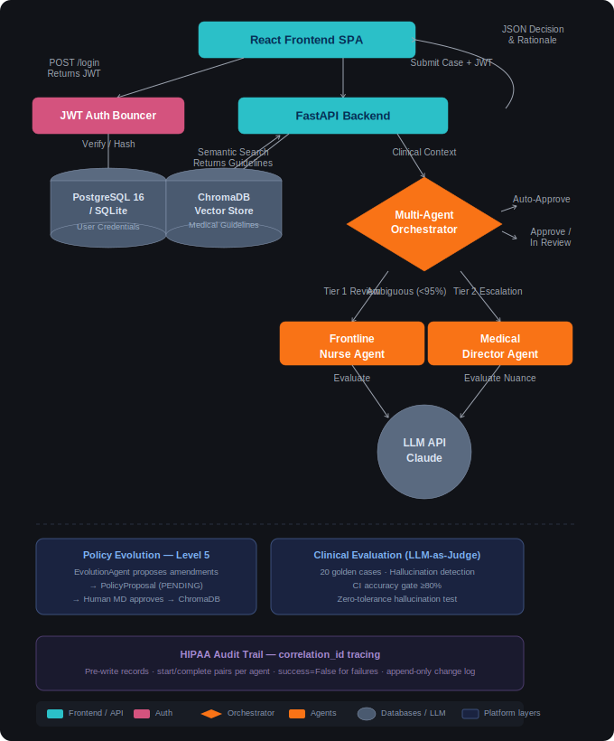
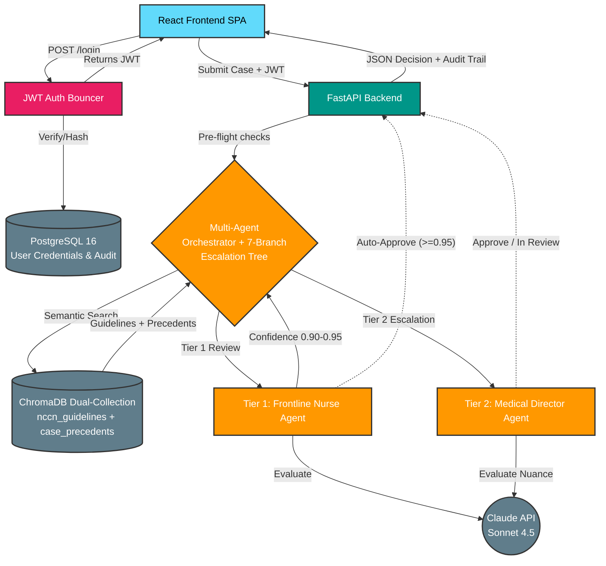
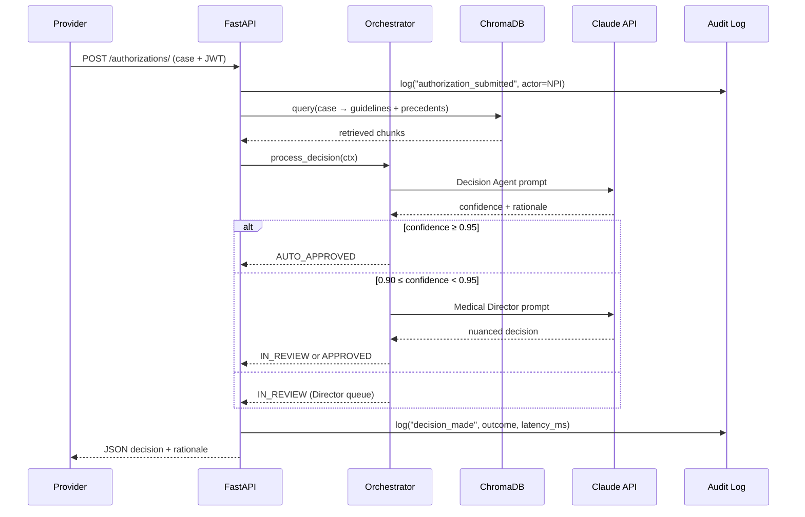
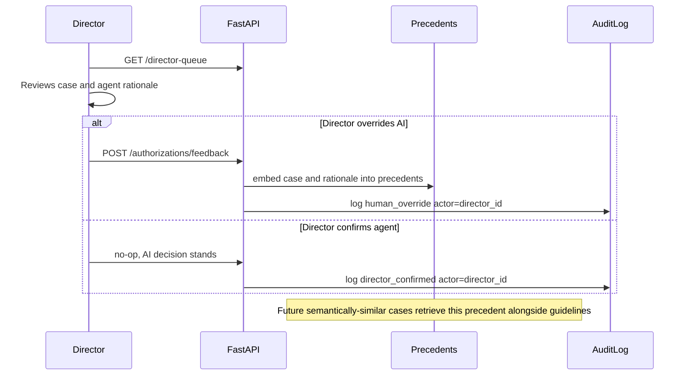
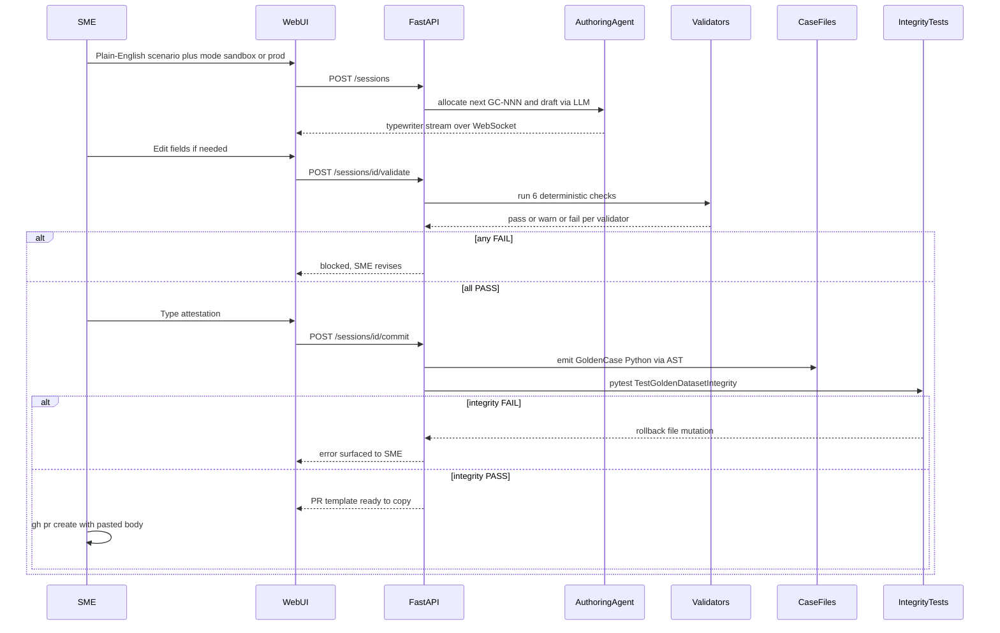
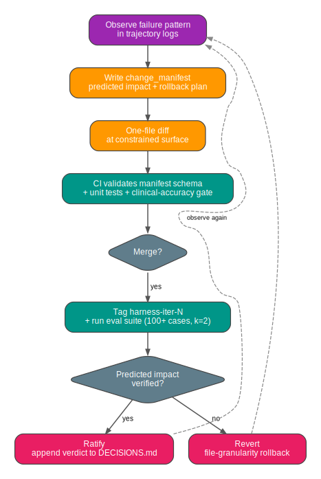
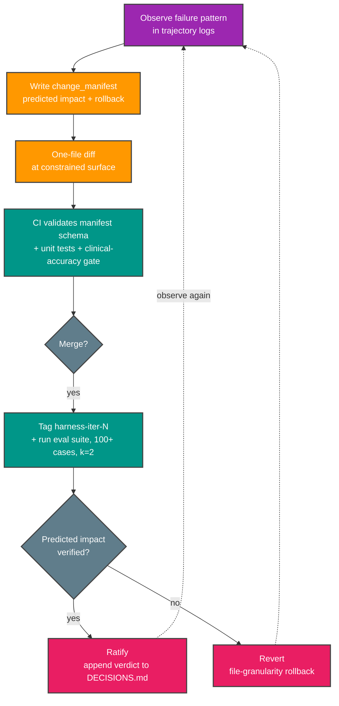

# PACCA — Prior Authorization & Care Coordination Agent Platform

**Multi-agent prior authorization with observability-driven harness engineering**

[Features](#features) • [Architecture](#architecture) • [Harness Engineering](#harness-engineering) • [Quick Start](#quick-start) • [API Docs](#api-documentation) • [Demo](#demo-scenarios)

[](https://github.com/drdgreed/pacca/actions/workflows/ci.yml)
[](https://codecov.io/gh/drdgreed/pacca)
[](https://www.python.org/)
[](https://fastapi.tiangolo.com/)
[](https://react.dev/)
[](https://anthropic.com/)
[](#-portfolio-disclaimer)
[](https://github.com/astral-sh/ruff)
[](LICENSE)

---

## Portfolio disclaimer

PACCA is a **pre-production** project. It is **not HIPAA-validated**, has **no Business Associate Agreements** in place with any subcontractor, and **must not be used with real Protected Health Information**. Every clinical case in this repository is synthetic (see `tests/clinical/*_cases.py`). The pre-commit PHI guard (`.githooks/pacca_guard.py`) actively blocks PHI-shaped strings from being committed.

The engineering practices shown here — multi-agent orchestration, RAG over clinical guidelines, audit-grade observability, the harness-engineering discipline, the SME case-authoring workflow — are production-grade. The *deployment* is not. Treat the repo as a reference architecture, not a turnkey product.

What would close the gap to actual HIPAA compliance is documented in [`docs/PACCA_PRD_v2.4_Consolidated.md` § 16](docs/PACCA_PRD_v2.4_Consolidated.md) (SaMD-grade validation) and `docs/HIPAA_COMPLIANCE.md`. The short version: signed BAAs with every subcontractor (AWS, Anthropic, etc.), encryption-at-rest column-level, role-based access controls, breach-notification procedures, named Privacy + Security Officers, and an ongoing risk-assessment program. The code is one part of a much larger compliance posture.

---

## Overview

PACCA is a **secure, multi-agent AI workflow** that automates healthcare prior authorization reviews. It solves one of healthcare's most expensive bottlenecks ($50–100B annually in U.S. administrative overhead) by combining the reasoning capabilities of Large Language Models with strict deterministic grading rubrics, dual-collection vector retrieval, and a HIPAA-conscious audit infrastructure.

Unlike basic "LLM-wrapper" approaches, PACCA grounds every decision in factual medical guidelines via Retrieval-Augmented Generation, escalates to specialist tiers using a 7-branch deterministic decision tree, and applies **observability-driven harness engineering** to iterate the system itself.

**Current state.** PRD `v2.4` is the active spec (introduces §16 Clinical Validation Strategy). The `DecisionSupportAgent` prompt registry is at `v2.6` after iter-6's first deny-class institutional-memory entry. Harness iterations `iter-0` through `iter-6` are complete — each with a change manifest and a verified verdict cycle — and `iter-7` is seeded by the off-label-scanner finding recorded at iter-6 close (see [`docs/ITERATIONS.md`](docs/ITERATIONS.md)).

**A methodology, not just features.** The harness discipline — introduced in `v2.3` and active through every iteration since — requires every behavioral change to PACCA's agent harness to ship as a one-file diff with a falsifiable predicted-impact contract that the next evaluation round verifies. The methodology is adapted from Lin et al., *Agentic Harness Engineering* (arXiv:2604.25850, 2026). The repository's `docs/` folder makes the discipline auditable from outside.

> **Governance context.** PACCA is a Class 2/3 enterprise agent operating inside a [**CRISP-AG**](https://drdavidreed.com/portfolio)-style governance envelope. CRISP-AG is an artifact-centered framework for enterprise agentic AI governance that sits *beneath* ISO/IEC 42001 and NIST AI RMF — the standards establish what governance must achieve; CRISP-AG specifies what the producible artifacts look like. The harness-engineering discipline documented in this repo is a concrete instance of CRISP-AG's **Orchestration Contract** artifact; the seven-branch escalation tree and Medical Director gate instantiate the **Delegation Authority Scoping** artifact applied to a healthcare domain. See [drdavidreed.com/portfolio](https://drdavidreed.com/portfolio) for the full white paper.

### The Problem

Prior authorization is one of healthcare's most measurable failures:

- **Providers** spend 34+ hours/week per practice on prior authorization workflows
- **Patients** face treatment delays averaging 2–3 days, with 29% of delays directly harming care
- **Payers** process 200+ million requests annually, mostly manually
- **Reviewers** use outdated guideline versions in 35% of cases, with decision quality varying 18–35% by individual

### The Solution

PACCA automates the workflow using a five-agent hierarchical architecture with deterministic safety controls:

1. **Evidence Aggregation** — synthesizes scattered clinical data into coherent narratives
2. **Clinical Classification** — complexity scoring, specialty routing, urgency assessment
3. **Decision Support (Tier 1)** — guideline-based recommendations with chain-of-thought reasoning
4. **Medical Director (Tier 2)** — invoked for ambiguous cases (confidence 0.90–0.95)
5. **Policy Evolution (Governance)** — proposes amendments based on human-override patterns; deploys only with Medical Director approval

**Eight production-grade safety properties:**

- JWT-authenticated provider dashboard with bcrypt password hashing
- Dual-collection ChromaDB: official guidelines vs. institutional-memory precedents
- Chain-of-thought reasoning with anti-hallucination, uncertainty-flagging, and escalation-trigger guards on every agent
- 7-branch escalation tree (4 pre-flight + 3 post-agent) — deterministic safety logic that overrides AI confidence on experimental treatments, rare conditions, conflicting guidelines, and prior denials
- Pre-write HIPAA audit trail with correlation-ID linked event pairs
- OpenTelemetry → Langfuse distributed tracing on every agent call
- Runtime-adjustable operational parameters (confidence thresholds, retry budget, autonomy switch) without server restart
- Three-stage governance pipeline for AI-proposed guideline amendments — meets FDA SaMD change-control intent

---

## Architecture

<p align="center">
  
</p>

<details>
<summary>Mermaid source (click to expand)</summary>



</details>

For the complete architecture, see [`docs/ARCHITECTURE.md`](docs/ARCHITECTURE.md). For the harness layer specifically, see [`docs/HARNESS.md`](docs/HARNESS.md).

---

## Process Flow

Three concurrent workflows feed the same data store. Each generates audit records under a shared `correlation_id` so the full trace is queryable by one ID.

### Workflow A: Provider submits → agent decides



### Workflow B: Medical Director reviews escalation → teaches the system



### Workflow C: SME authors a new clinical test case



---

## Results

Numbers are *measured locally* (the unit and integration suites) or *clearly labeled as benchmark/simulated* where they reflect synthesized cases rather than production traffic. The repository ships with no real PHI, so all clinical numbers come from the 53-case synthesized demo dataset and the 105-case clinical evaluation dataset (GC-001 through GC-105).

| Metric | Value | Source |
|---|---|---|
| **Unit tests** | 531 test functions | `pytest tests/unit` |
| **Total tests across tiers** | 590 test functions (531 unit + 28 clinical + 27 harness) | `pytest tests/ --collect-only` |
| **Clinical evaluation dataset** | 105 cases (GC-001–GC-105), ~20 thematic suites (oncology, cardiology, pediatric, geriatric, transplant, mental health, denial, …), integrity-verified | `tests/clinical/`, `TestGoldenDatasetIntegrity` |
| **Clinical-accuracy CI gate** | ≥80% pass rate on the 20-case golden core, LLM-as-judge (Claude Haiku, 1–5 rubric). **At iter-6 close: 20/20 pass, mean 4.9/5, zero jitter across k=2 rollouts** | `tests/clinical/`, fails the build below threshold |
| **Hallucination tolerance** | **Zero** — sparse-notes traps GC-018, GC-019 fail the build on any score-1 hallucination | `tests/unit/test_clinical_accuracy.py` |
| **Lint posture** | `ruff check src/ tests/` — clean | CI lint job |
| **Median decision latency** *(benchmark, single-process)* | ~2.1 s | Synthesized 53-case run, Sonnet 4.5 |
| **95p decision latency** *(benchmark, single-process)* | ~4.3 s | Same |
| **Auto-approval rate** *(synthesized dataset)* | 28% (15 / 53 cases) | Group A — complete documentation, explicit guideline alignment |
| **Human-review rate** *(synthesized dataset)* | 19% (10 / 53 cases) | Group B — missing documentation, hallucination traps |
| **Pre-flight escalations triggered** *(synthesized dataset)* | 32% (17 / 53 cases) | Groups D–G — experimental treatment, rare condition, conflicting guidelines, prior denial |
| **Cost per decision** *(simulated, Sonnet 4.5 at current pricing)* | ~$0.04 | Token-counted per case; pricing as of 2026-05 |
| **Harness iterations recorded** | 7 complete (`iter-0` … `iter-6`), each with a change manifest and predicted-vs-observed verdicts; `iter-7` seeded | `harness/manifests/iter-{0..6}.json`, [`docs/ITERATIONS.md`](docs/ITERATIONS.md) |
| **Methodology source** | Lin et al., *Agentic Harness Engineering* | [arXiv:2604.25850](https://arxiv.org/abs/2604.25850) |

> **What is *not* measured yet:** sustained-load latency, aggregate cost-per-decision at production volume, and adversarial prompt-injection resistance. These are the remaining Phase H5 (Evaluation Harness Expansion) deliverables — the dataset side of H5 is well underway (20 → 105 cases). See [`docs/EVALUATION.md`](docs/EVALUATION.md) and [`docs/DATASET_SUFFICIENCY.md`](docs/DATASET_SUFFICIENCY.md) for methodology and the gap list.

---

## Harness Engineering

> *Beginning with v2.3, PACCA is iterated using a structured, falsifiable methodology. Every behavioral change is a one-file diff with a recorded prediction. The next evaluation round verifies the prediction. Rejected changes are reverted at file granularity.*

<p align="center">
  
</p>

<details>
<summary>Mermaid source for the iteration cycle (click to expand)</summary>



</details>

The methodology adapts the AHE paper's three observability pillars to a healthcare domain:

| Pillar | PACCA Implementation |
|--------|----------------------|
| **Component observability** | 11 editable harness surfaces (7 NexAU-standard + 4 PACCA-specific), each at a fixed file path with one-file-diff rollback |
| **Experience observability** | OpenTelemetry spans → Langfuse + structured trajectory logs alongside the HIPAA audit trail |
| **Decision observability** | Every change ships with a [`change_manifest`](harness/manifests/change_manifest.schema.json) entry; verdicts logged in [`DECISIONS.md`](docs/DECISIONS.md) |

### The Four Harness Engineering Documents

| Document | Purpose |
|----------|---------|
| 📐 **[`docs/HARNESS.md`](docs/HARNESS.md)** | Architectural reference. The seven AHE component types plus PACCA's four healthcare-specific harness surfaces, with rules for editing each. |
| 📋 **[`docs/DECISIONS.md`](docs/DECISIONS.md)** | Append-only log of every behavioral change with predictions and verified outcomes. The audit trail of the iteration cycle itself. |
| 📖 **[`docs/ITERATIONS.md`](docs/ITERATIONS.md)** | Narrative log per iteration tag. Format borrowed from the AHE paper's Appendix C — failure pattern → change → trajectory before/after → eval delta. |
| 🔒 **[`harness/manifests/change_manifest.schema.json`](harness/manifests/change_manifest.schema.json)** | JSON Schema 2020-12 specification for change manifests. Includes PACCA-specific fields (`phi_impact`, `audit_relevant`) tying the discipline to healthcare governance requirements. |

### v2.4 Cycle Phases

The v2.4 release commits PACCA to a six-phase cycle over 10–12 weeks. Each phase has explicit exit criteria verifiable from git history and the evaluation suite:

| Phase | Name | Constraint Levels | Status |
|-------|------|-------------------|--------|
| **H0** | Baseline Crystallization | Instrumentation only | ✅ Delivered (iter-0) |
| **H1** | Component Decoupling | system_prompt, tool_description, tool_implementation | ✅ Delivered (iter-1: prompt extraction to file-level mounts) |
| **H2** | Institutional Memory Layer | long_term_memory | ✅ Delivered & compounding (four memory entries across iters 3–6, incl. the first deny-class entry) |
| **H3** | Cross-Step Middleware Tier | middleware | 🔄 Started — the P-4 minimum-necessary scope guard (first middleware-pattern component, a call-site wrapper) is **wired into the submit route in enforce mode**. See [Governance rollout](#governance-rollout). |
| **H4** | Change Manifest Discipline | Process layer | ✅ Active on every change since iter-1 |
| **H5** | Evaluation Harness Expansion | Eval infrastructure | 🔄 In progress — dataset 20 → 105 cases, k=2 rollouts on the golden core; unified benchmark + load/adversarial testing pending |

Full phase specifications, exit criteria, expected impact, and AHE paper citations are in **[the consolidated PRD §15](docs/PACCA_PRD_v2.4_Consolidated.md)**.

### Governance rollout

A focused sequence layering **runtime governance** onto the harness discipline. Each step is either a governed change (manifest + verdict) or a documentation-truth pass:

| Step | What it adds | Status |
|------|--------------|--------|
| **P-0 / P-1 / P-2** | Doc-truth reconciliation of `CLAUDE.md` + `HARNESS.md`; a doc-drift guard wired into CI; a real `pacca.harness.validate_manifest` CLI | ✅ Merged |
| **P-3 — IntentRecord** | Per-run typed intent contract, emitted as the **first** audit event (`intent.declared`); record-only, read by P-4/P-5 | ✅ In review (chg-7 / iter-7) |
| **P-4 — Minimum-necessary scope guard** | Fail-closed `enforce_scope` against the `IntentRecord` (unknown action / cross-case identifier / non-allowed collection → human review), promoted **warn → enforce** | ✅ chg-8 → chg-9 — wired into the submit route in **enforce** mode at the RAG + two identifier-checked DB-write sites; a cross-case leak fail-closes to human review |
| **P-5 — Evidence-grounding detector** | Runtime check that a finding's rationale cites evidence IDs actually present in the submission; ungrounded citations route to human review | ⏳ Planned |
| **P-6 — CI enforcement** | Makes manifest validation and the GC-018/019 clinical gate **build-blocking** (`validate-manifests` + `clinical-gate` jobs) | ⏳ Planned |

Honest-architecture note: the scope guard is a call-site **wrapper**, not a framework middleware file — PACCA has no middleware loader yet (see [`CLAUDE.md`](CLAUDE.md) Limitations). It is the first concrete instance of the H3 middleware tier.

---

## Features

### 📋 Clinical Decision Support

- RAG-powered guideline retrieval using ChromaDB dual-collection
- Evidence-based recommendations with confidence scores
- Transparent decision rationale, audit-logged
- Step therapy and prior treatment requirement support

### 👥 Human Oversight

- Configurable confidence thresholds for autonomous decisions
- 7-branch escalation tree with 4 pre-flight deterministic checks (experimental treatment, rare condition, conflicting guidelines, prior denial)
- Medical Director review interface with AI-generated case summaries
- Complete audit trail for regulatory compliance

### 📚 RAG and Institutional Memory

- **`nccn_guidelines`** — authoritative clinical guidelines (NCCN, CMS, AHA, ADA, ACR), quarterly updates, independent versioning and rollback
- **`case_precedents`** — Medical Director override decisions with documented rationales, embedded immediately, surfaced in semantically similar future cases
- v2.4+ adds per-agent `long_term_memory.md` files: human-readable, git-versioned cross-cutting clinical lessons that ride in the prompt context on every request (Phase H2)

### 🛡️ Production-Grade Safety

- **Anti-hallucination guards** on every agent ("only reference clinical evidence explicitly present in the submission")
- **Hallucination zero-tolerance tests** (GC-018, GC-019) — sparse-notes traps that fail the build on any score-1 hallucination
- **Tool-use API forced** for structured output — eliminates the most common agentic failure mode
- **Pre-write audit trail** — correlation-ID-linked event pairs flushed before any state change
- **Per-run intent contract (`IntentRecord`)** — every prior-authorization run declares its scope (allowed collections + actions, opaque subject reference, expected effects) as the **first** audit event (`intent.declared`), so the whole trail begins with what the run was permitted to do
- **Minimum-necessary scope guard** *(landing incrementally — see below)* — a fail-closed `enforce_scope` wrapper that expresses the HIPAA minimum-necessary standard in code: it denies any tool / DB / RAG call outside the run's `IntentRecord` scope (unknown action, cross-case identifier mismatch, non-allowed collection) and routes a violation to human review (`EscalationReason.SCOPE_VIOLATION`). **Status:** wired into the submit route in **enforce** mode (chg-8 → chg-9) at three sites — the two identifier-checked DB writes (`db.write_request`, `db.write_decision`) and the RAG query. Correct operation always passes the run's own scope, so it does not deny in normal flow; its value is fail-closed defense against a leak/bug. See [Governance rollout](#governance-rollout).
- **Append-only PolicyChangeLogEntry** — immutable record of every guideline amendment, mapped to FDA SaMD Action Plan change-control requirements

### 🔧 Production-Ready Architecture

- FastAPI backend with full async support
- React 18 frontend with real-time updates
- PostgreSQL 16 for persistence, SQLite for development (one env-var switch)
- Dual-collection ChromaDB with metadata filtering
- OpenTelemetry → Langfuse distributed tracing (Docker Compose included)
- Comprehensive test coverage: 590 test functions across unit / clinical / harness tiers (Python) + Playwright smoke tests (frontend)

### ✍️ SME Case Authoring Agent (2026-Q2)

The clinical-evaluation dataset has grown from 33 → 105 cases and continues toward the roadmap milestones: 300 (general-payer) → 500+ (SaMD-grade). Authoring each case used to take an engineer 60–90 minutes per case to translate clinical knowledge into Python, wire it into the test aggregator, update companion docs, and verify integrity tests. **The SME Case Authoring Agent removes the engineer middleware entirely.**

A clinician runs one command (CLI) or opens the browser to `/sme-author` (Web UI), describes a clinical scenario in plain English, reviews the agent's draft case, attests their professional review, and the agent handles everything else:

- Allocates a monotonic `GC-NNN` case ID (file-locked across concurrent SMEs)
- Runs six deterministic validators (PHI scan, guideline citation, schema completeness, outcome ↔ branch consistency, reasoning specificity, judge criteria specificity) — failures block the write
- Routes to the correct thematic case file
- Emits valid Python via AST manipulation (parses + idempotent)
- Updates `docs/CASE_PROVENANCE.md` with one row including the SME attestation
- Bumps `docs/EVALUATION_COVERAGE.md` cells
- Runs `pytest TestGoldenDatasetIntegrity` and **rolls back the file mutation on any failure**
- Generates a PR template with the SME attestation embedded

**Two surfaces, one library.** The CLI (`pacca sme-author new`) and the Web UI (`/sme-author/new` — 6-step wizard with WebSocket live-drafting) call the same underlying `src/pacca/agents/sme_authoring/` Python modules. SMEs pick the interface they prefer; the audit trail is identical.

**Architecture details:** [`docs/SME_CASE_AGENT_DESIGN.md`](docs/SME_CASE_AGENT_DESIGN.md) (engineering). **Clinician walkthrough:** [`docs/SME_CASE_AGENT_USER_MANUAL.md`](docs/SME_CASE_AGENT_USER_MANUAL.md) (Section 11 = Web UI, Sections 1–10 = CLI).

### 🎨 Editorial-Clinical Design System (2026-Q2)

Every PACCA surface (Login, Provider, Director Queue, Admin, SME Authoring) uses a single visual identity:

- **Typography**: Source Serif 4 body, Spectral display, JetBrains Mono technical (case IDs, codes, timestamps)
- **Palette**: warm cream paper (`#faf8f3`), ink text, navy emphasis, forest-green approve, oxblood deny, mustard review
- **Status color is ink, not filled badges** — `<StatusInk outcome="approved">` is a colored text span, never a pill
- **Hairline rules + small-caps section labels** for editorial rhythm
- **Restrained motion** — 200ms fade + 4px translate-up on page-enter, no bounce
- **CSS bundle: ~3.5 KB gzipped** (Tailwind retained for layout utilities only; colors + typography owned by `frontend/src/styles/theme.css`)

The single global stylesheet is **15 files / ~400 LOC** and powers every surface. See [`docs/SME_WEB_UI_DEPLOYMENT.md`](docs/SME_WEB_UI_DEPLOYMENT.md) for the production deployment topology + CSP allowlist + nginx config.

---

## Quick Start

### Prerequisites

- Python 3.12+
- Node.js 18+ (for frontend)
- Docker & Docker Compose (recommended)
- Anthropic API key

### Option 1: Docker (Recommended)

```bash
# Clone the repository
git clone https://github.com/drdgreed/pacca.git
cd pacca

# Set up environment
cp .env.example .env
# Edit .env and add your ANTHROPIC_API_KEY

# Start all services (FastAPI, frontend, ChromaDB, PostgreSQL, Langfuse)
docker-compose up -d

# Access the application
# Frontend:    http://localhost:3000
# API:         http://localhost:8000
# API Docs:    http://localhost:8000/docs
# Langfuse:    http://localhost:3001
```

### Option 2: Local Development

```bash
# Clone and set up
git clone https://github.com/drdgreed/pacca.git
cd pacca

# Create virtual environment
python -m venv .venv
source .venv/bin/activate  # or `.venv\Scripts\activate` on Windows

# Install Python + Node dependencies
pip install -e ".[dev]"
cd frontend && npm install && cd ..

# Set environment variables (your Anthropic key is required for agent calls)
export ANTHROPIC_API_KEY=sk-ant-your-key-here
export DATABASE_URL=sqlite+aiosqlite:///./pacca.db
export SECRET_KEY=$(python -c 'import secrets; print(secrets.token_urlsafe(48))')
export CORS_ORIGINS=http://localhost:3000

# Boot both servers (backend on :8000, frontend on :3000)
make sme-author-web
```

Browse <http://localhost:3000/login>. Register your first user via `/admin` after sign-in, or by hitting `POST /api/v1/register/` directly. There is no default admin account by design — the portfolio context doesn't ship shared credentials.

### Authoring clinical cases as an SME

```bash
# CLI workflow (for engineers + power users)
make sme-author          # interactive new-case session
make sme-author-status   # dataset state + milestone gaps
make sme-author-help     # CLI subcommand reference

# Web UI workflow (clinician-friendly)
make sme-author-web      # boots both servers, then browse /sme-author/new

# Playwright smoke tests (one-time browser install required)
cd frontend && npm run test:e2e:install
make sme-author-web-e2e
```

### Running Tests

```bash
# Full test suite (590 test functions across tiers)
pytest

# With coverage report
pytest --cov=pacca --cov-report=html

# Test tiers
pytest tests/unit/                             # 531 unit tests
pytest tests/clinical/                         # Clinical reasoning + LLM-as-judge (105-case dataset)
pytest tests/harness/                          # Harness discipline + manifest validation

# v2.4+: harness benchmark suite (Phase H5 deliverable)
pytest tests/eval/                             # 100+ case benchmark with k=2 rollouts
```

### Validating Change Manifests (v2.4+)

```bash
# Validate a manifest against the schema before committing
python -m pacca.harness.validate_manifest harness/manifests/iter-1.json
```

---

## API Documentation

### Submit Authorization Request

```http
POST /api/v1/authorizations/
Authorization: Bearer <jwt-token>
Content-Type: application/json

{
  "patient": {
    "id": "P12345",
    "date_of_birth": "1966-05-15",
    "gender": "M"
  },
  "diagnosis": {
    "code": "C34.1",
    "description": "Malignant neoplasm of upper lobe, bronchus or lung"
  },
  "treatment": {
    "code": "J9271",
    "code_type": "HCPCS",
    "description": "Pembrolizumab injection",
    "category": "medication",
    "estimated_cost": 15000.00
  },
  "provider": {
    "provider_id": "1234567890",
    "provider_name": "Dr. Jane Smith"
  },
  "payer": {
    "payer_id": "BCBS001",
    "payer_name": "Blue Cross Blue Shield",
    "member_id": "MEM123456"
  },
  "clinical_notes": "Patient with stage IIIA NSCLC, PD-L1 TPS ≥50%...",
  "urgency": "expedited"
}
```

### Response

```json
{
  "request_id": "AUTH-01HQXYZ...",
  "status": "approved",
  "decision": "approve",
  "confidence_score": 0.92,
  "decision_summary": "Authorization approved based on NCCN guidelines...",
  "complexity": 3,
  "specialty": "oncology",
  "requires_human_review": false,
  "harness_iteration_tag": "harness-iter-6",
  "prompt_registry_versions": {
    "decision_support": "v2.6",
    "medical_director": "v2.2"
  }
}
```

### Endpoints

| Method | Endpoint | Description |
|--------|----------|-------------|
| POST | `/api/v1/register/` | Create a new user account |
| POST | `/api/v1/login/` | Exchange credentials for JWT |
| POST | `/api/v1/authorizations/` | Submit authorization request |
| POST | `/api/v1/authorizations/feedback` | Medical Director override → vector-store precedent |
| GET | `/api/v1/admin/config` | Read operational configuration |
| PATCH | `/api/v1/admin/config` | Update config at runtime |
| GET | `/api/v1/admin/proposals` | Pending policy proposals |
| POST | `/api/v1/admin/proposals/{id}/approve` | Approve and deploy guideline amendment |
| GET | `/api/v1/admin/change-log` | Immutable policy change audit log |
| GET | `/api/v1/admin/harness/iterations` | List harness iteration tags |
| **SME Authoring Agent (2026-Q2)** | | |
| GET | `/api/v1/sme-authoring/status` | Dataset state: total cases, per-file counts, milestone gaps |
| GET | `/api/v1/sme-authoring/batches` | List planned authoring batches from the roadmap |
| GET | `/api/v1/sme-authoring/batches/{id}` | One batch's case-slot manifest |
| GET | `/api/v1/sme-authoring/gaps` | Prioritized coverage gaps |
| GET / POST | `/api/v1/sme-authoring/sessions` | List or create an authoring session |
| GET / DELETE | `/api/v1/sme-authoring/sessions/{id}` | Inspect or remove a session |
| POST | `/api/v1/sme-authoring/sessions/{id}/draft` | Generate LLM draft (buffered REST) |
| POST | `/api/v1/sme-authoring/sessions/{id}/validate` | Run six deterministic validators |
| POST | `/api/v1/sme-authoring/sessions/{id}/commit` | Commit with SME attestation |
| WebSocket | `/api/v1/sme-authoring/sessions/{id}/draft-stream` | Live token streaming with first-message JWT auth |
| GET | `/health` | Health check |

Full API documentation at `/docs` when running the server (Swagger UI).

---

## Demo Scenarios

PACCA includes 53 synthesized cases across 8 groups (A–H) covering all 7 escalation branches:

| Group | Cases | Scenario |
|-------|-------|----------|
| A | 15 | Auto-approved — complete documentation, explicit guideline alignment |
| B | 10 | Human review — missing documentation, hallucination traps |
| C | 8 | MD escalation — cost > $100K or borderline confidence |
| D | 5 | Experimental treatment pre-flight — CAR-T, gene therapy |
| E | 4 | Rare condition pre-flight — Gaucher, Huntington, ALS, Wilson disease |
| F | 4 | Conflicting guidelines pre-flight — NCCN vs. CMS vs. payer LCD |
| G | 4 | Prior denial pre-flight — resubmissions, fraud patterns |
| H | 3 | Precedent-based approvals — institutional memory in action |

Plus a 105-case clinical evaluation dataset (GC-001–GC-105) whose 20-case golden core is CI-gated at ≥80% accuracy with LLM-as-judge scoring (Claude Haiku, 1–5 rubric) — currently 20/20 at mean 4.9/5. Hallucinations score automatic 1 — there is no acceptable rate of inventing clinical data.

Phase H5 (in progress) unifies these case sources into a single benchmark with k=2 rollouts per case and pass@1 / tokens-per-case / Succ/Mtok metrics; the dataset side (105 cases) is already on disk.

---

## Configuration

### Environment Variables

| Variable | Description | Default | Production |
|----------|-------------|---------|------------|
| `ANTHROPIC_API_KEY` | Claude API key | Required | Required + BAA |
| `SECRET_KEY` | JWT signing key (≥32 chars) | Required | Rotate quarterly |
| `DATABASE_URL` | Database connection | SQLite | PostgreSQL 16 |
| `TOKEN_EXPIRE_MINUTES` | JWT expiry | 30 | 15–30 |
| `AUTO_APPROVE_CONFIDENCE_THRESHOLD` | Auto-approve threshold | 0.95 | 0.95–0.98 |
| `ESCALATION_CONFIDENCE_THRESHOLD` | MD escalation threshold | 0.90 | 0.90–0.95 |
| `HIGH_COST_THRESHOLD` | Cost escalation trigger (USD) | 100000 | Per payer contract |
| `LLM_RETRY_MAX_ATTEMPTS` | Max LLM retry attempts | 3 | 3–5 |
| `ENABLE_AUTONOMOUS_DECISIONS` | Master autonomy switch | true | true (false for audit) |

See [`.env.example`](.env.example) for all configuration options.

---

## Project Structure

```
pacca/
├── src/pacca/
│   ├── agents/              # Multi-agent framework
│   │   ├── decision_support/    # Phase H1/H2 component mounts
│   │   │   ├── system_prompt.md     # System prompt as standalone file (H1)
│   │   │   └── long_term_memory.md  # Institutional memory (H2, four entries)
│   │   ├── medical_director/    # Same component-mount layout
│   │   ├── sme_authoring/       # SME Case Authoring Agent (CLI + Web UI share this)
│   │   ├── prompts/             # Shared PROMPT_REGISTRY (v2.6)
│   │   ├── tools/               # Agent tool implementations
│   │   ├── orchestrator.py      # 7-branch escalation tree
│   │   ├── evidence_agent.py · classification_agent.py · evolution.py
│   │   └── clinical_risk_detector.py
│   ├── api/                 # FastAPI application
│   ├── cli.py               # `pacca` CLI (sme-author, …)
│   ├── config/              # Settings and logging
│   ├── db/                  # Database, models, repository, migrations
│   ├── integrations/        # External-service adapters
│   ├── models/              # Pydantic domain models
│   ├── rag/                 # ChromaDB dual-collection pipeline
│   └── utils/
├── frontend/                # React 18 + TypeScript + Vite frontend
├── harness/manifests/       # change_manifest.schema.json + iter-0 … iter-6 manifests & verdicts
├── tests/
│   ├── unit/                # 531 unit tests
│   ├── clinical/            # 105-case evaluation dataset + LLM-as-judge harness
│   ├── harness/             # Manifest-discipline + benchmark tests
│   └── integration/
├── demo/                    # 53-case synthesized demo dataset
├── docs/                    # ARCHITECTURE, HARNESS, DECISIONS, ITERATIONS, EVALUATION,
│                            #   EVALUATION_COVERAGE, DATASET_SUFFICIENCY, PACCA_PRD_v2.4_Consolidated, …
└── docker-compose.yml       # Full stack including Langfuse
```

---

## Technology Stack

| Layer | Technology | Notes |
|-------|------------|-------|
| **LLM** | Claude (Anthropic API), `claude-sonnet-4-5` | Tool-use forced for structured output |
| **Backend** | Python 3.12, FastAPI, Pydantic v2 | Fully async throughout |
| **Production DB** | PostgreSQL 16, SQLAlchemy 2.0, Alembic | JSONB compliance queries, async pool |
| **Dev DB** | SQLite (same ORM layer) | One env var to switch |
| **Vector Store** | ChromaDB 0.5+, dual-collection | Different trust levels per collection |
| **Cache** | Redis (optional) | 40–60% token reduction at scale (V2 release) |
| **Frontend** | React 18, TypeScript, Tailwind CSS | Vite build pipeline |
| **Observability** | OpenTelemetry → Langfuse 1.27+ | One span per agent call |
| **Testing** | pytest, pytest-asyncio, pytest-cov | 590 test functions + k=2 eval rollouts |
| **Security** | python-jose, bcrypt | JWT + timing-safe passwords |
| **Manifest validation** | jsonschema (Draft 2020-12) | v2.4+: validates change manifests in CI |
| **CI/CD** | GitHub Actions | Includes manifest schema validation |
| **Containerization** | Docker, Docker Compose | 6 services in full stack |

---

## Documentation Map

PACCA's documentation is structured to serve four audiences: engineers, healthcare reviewers, recruiters and the agentic AI community evaluating the work, and future iterations of PACCA itself.

### Core architecture and methodology

- **[`docs/ARCHITECTURE.md`](docs/ARCHITECTURE.md)** — system architecture, component responsibilities, request lifecycle
- **[`docs/HARNESS.md`](docs/HARNESS.md)** — harness layer reference: 11 editable surfaces, three rules of engagement, three observability pillars
- **[`docs/PACCA_PRD_v2.4_Consolidated.md`](docs/PACCA_PRD_v2.4_Consolidated.md)** — full Product Requirements Document, including the harness engineering cycle phases (H0–H5) and §16 Clinical Validation Strategy

### Iteration record (v2.4+)

- **[`docs/DECISIONS.md`](docs/DECISIONS.md)** — append-only log of every behavioral change with predictions and verdicts
- **[`docs/ITERATIONS.md`](docs/ITERATIONS.md)** — narrative log per iteration tag (paper Appendix C format)
- **[`docs/EVALUATION.md`](docs/EVALUATION.md)** — benchmark methodology, scores, regression history
- **[`docs/EVALUATION_COVERAGE.md`](docs/EVALUATION_COVERAGE.md)** — per-cell coverage matrix (dimension × case ID); re-baseline to the 105-case dataset in progress
- **[`docs/DATASET_SUFFICIENCY.md`](docs/DATASET_SUFFICIENCY.md)** — statistical grounding for dataset-growth milestones (105 → 300 → 500+)
- **[`CHANGELOG.md`](CHANGELOG.md)** — per-iteration changelog with eval delta and verified predictions

### Machine-readable specifications

- **[`harness/manifests/change_manifest.schema.json`](harness/manifests/change_manifest.schema.json)** — JSON Schema 2020-12 specification for change manifests
- **[`harness/manifests/iter-N.json`](harness/manifests/)** — per-iteration manifest entries
- **[`harness/manifests/iter-N-verdicts.json`](harness/manifests/)** — per-iteration verdict files (CI-generated)

### Governance framework (external)

- **[CRISP-AG White Paper v2.3](https://drdavidreed.com/portfolio)** — *CRISP-AG: An Artifact-Centered Framework for Enterprise Agentic AI Governance.* Specifies the four implementation artifacts (Delegation Authority Scoping, Contractor Access Governance, Orchestration Contract, Capability Frontier Classification) and nine-phase lifecycle that PACCA's harness engineering implements at the code layer. Sits beneath ISO/IEC 42001 and NIST AI RMF.

---

## About the Author

**David Reed, Ph.D.** — Former Head of AI/ML & Agentic Delivery at Interview Kickstart. PhD in Computer Science, MBA, PMP, Wharton AI Fellow. Holder of [US Patent 6,850,988](https://patents.google.com/patent/US6850988) — the foundational recommendation-engine architecture developed at Oracle and later widely deployed in commerce. Formerly Master Technologist at Hewlett-Packard (Distinguished/Principal-IC track) and Principal TPM-AI at Microsoft. 35+ years across data warehousing, enterprise AI/ML, and edtech, including leading a $70M data-science curriculum portfolio across R1 universities.

I built PACCA to demonstrate end-to-end agentic AI engineering on a high-stakes, regulated domain — healthcare prior authorization — where correctness, explainability, human oversight, and observability all matter equally. Beginning with v2.3, the project commits to a falsifiable harness-engineering methodology adapted from Lin et al. (arXiv:2604.25850, 2026) — every behavioral change ships as a one-file diff with a recorded prediction, and the next evaluation round verifies or rejects it at file granularity. The discipline is a concrete instance of the [CRISP-AG](https://drdavidreed.com/portfolio) Orchestration Contract artifact applied to a regulated healthcare domain.

[Portfolio](https://drdavidreed.com) · [LinkedIn](https://linkedin.com/in/drdgreed) · drdgreed@gmail.com

---

## Contributing

Contributions are welcome. PACCA's contribution model has two paths:

- **Standard PRs** — refactors, documentation, infra, dependency bumps, non-behavioral fixes.
- **Behavioral PRs (harness-engineering discipline)** — anything that changes how an agent reasons, what tools it can call, what middleware fires, or what memory context it sees. Requires a one-file diff plus a manifest entry under [`harness/manifests/`](harness/manifests/).

Full details on local setup, the two-path workflow, the manifest schema, and the predicted-vs-observed verdict cycle are in [`CONTRIBUTING.md`](CONTRIBUTING.md). Security-related findings should follow [`SECURITY.md`](SECURITY.md) instead — please do not open a public issue.

By contributing you agree to the [Code of Conduct](CODE_OF_CONDUCT.md).

---


<!-- ci: no-op probe to verify clinical-gate skips on doc-only PRs (branch-protection stage 2b). Safe to close. -->
## Citation

If you reference PACCA's harness engineering implementation in academic work or production case studies, please cite:

```
Reed, D. (2026). PACCA: Prior Authorization & Care Coordination Agent Platform —
v2.4 Consolidated PRD. github.com/drdgreed/pacca.

Methodology adapted from:
Lin, J., Liu, S., Pan, C., Lin, L., Dou, S., Huang, X., Yan, H., Han, Z., & Gui, T. (2026).
Agentic Harness Engineering: Observability-Driven Automatic Evolution of
Coding-Agent Harnesses. arXiv:2604.25850v3.
```

---

## License

MIT — see [LICENSE](LICENSE) for details.

---

## Acknowledgments

- Built with [Claude](https://anthropic.com) by Anthropic
- Methodology informed by Lin et al., *Agentic Harness Engineering* (arXiv:2604.25850, 2026)
- Clinical guidelines based on publicly available NCCN, ACR, AHA, ADA, and CMS guidance
- Inspired by real-world healthcare prior authorization challenges affecting 200+ million patients annually

---

**PACCA v2.4** — Healthcare Prior Authorization, Iterated Like Engineering
*github.com/drdgreed/pacca | David Reed, PhD | July 2026*
