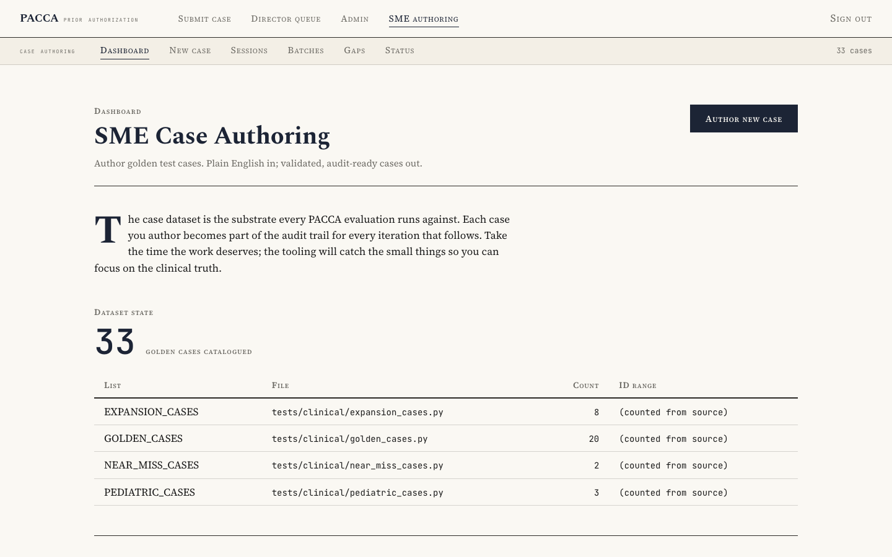
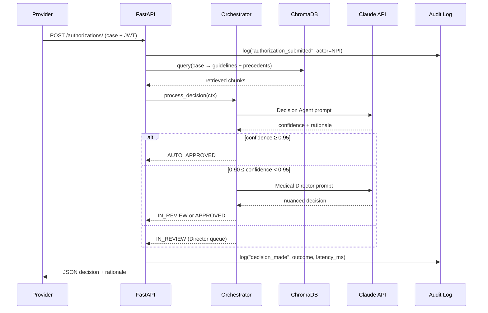
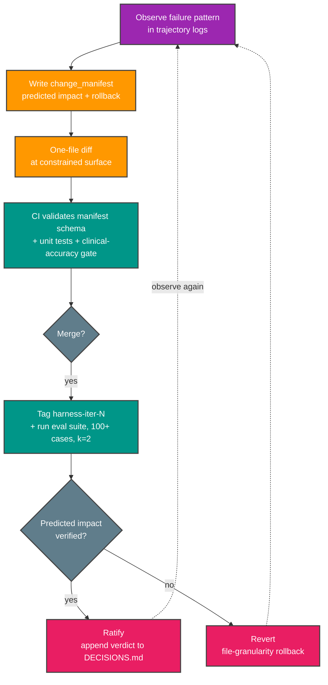
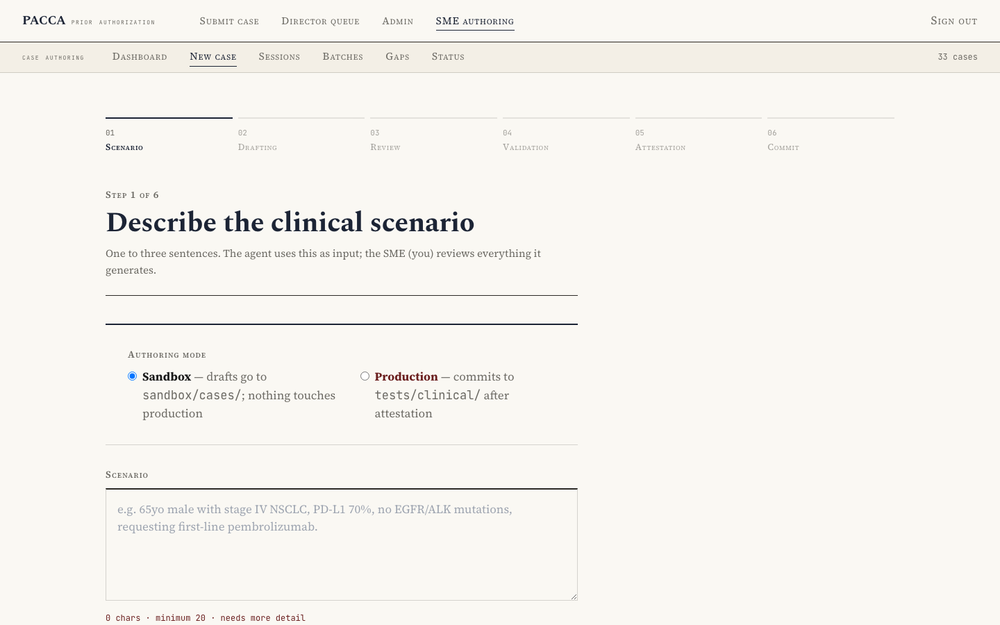
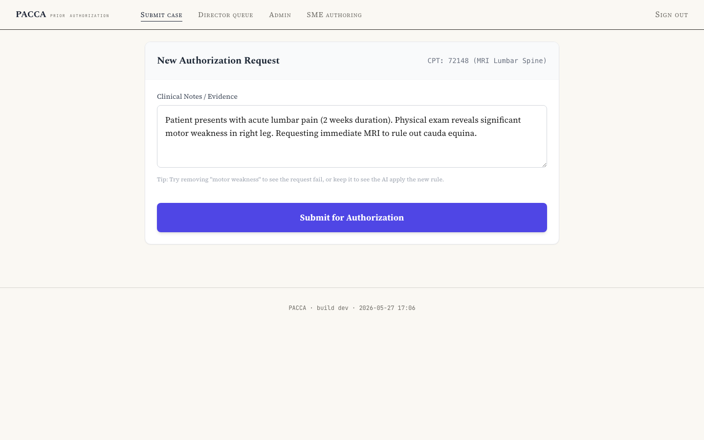

<div align="center">

# PACCA

### Prior Authorization & Care Coordination Agent

**A multi-agent healthcare AI platform with audit-grade observability, a clinician-facing case-authoring agent, and a unified Editorial-Clinical design system.**

[](https://github.com/drdgreed/pacca/actions/workflows/ci.yml)
[](https://codecov.io/gh/drdgreed/pacca)
[](https://anthropic.com/)
[](https://www.python.org/)
[](https://fastapi.tiangolo.com/)
[](https://react.dev/)
[](#portfolio-disclaimer)
[](LICENSE)

<a href="docs/images/screenshot-03-sme-dashboard.png"></a>

*SME Case Authoring dashboard — the Editorial-Clinical design system across every PACCA surface*

[Why this matters](#why-this-matters) • [Engineering depth](#engineering-depth-on-display) • [Claude API patterns](#claude-api--agentic-patterns) • [Architecture](#architecture) • [Process Flow](#process-flow) • [Quick Start](#quick-start) • [Portfolio disclaimer](#portfolio-disclaimer)

</div>

---

## Why this matters

**Prior authorization is healthcare's most measurable failure.** Providers spend 34+ hours per practice per week navigating it. Patients face an average 2–3 day treatment delay, with 29% of delays directly harming care. Payers process 200+ million requests annually, mostly by hand. Reviewers work from outdated guideline versions 35% of the time, with decision quality varying 18–35% between individuals. The total US administrative burden is **$50–100B annually**.

The conventional fix — "wrap an LLM around the existing form" — fails because prior authorization isn't a text-summarization problem. It's a **multi-stakeholder, evidence-grounded, auditable clinical decision** with regulatory consequences and zero tolerance for hallucinated facts.

PACCA is the engineering answer to *what would a system that actually handles this responsibly look like*. Five agents (frontline clinical, classification, decision support, medical director, policy evolution) with **forced-tool-use structured output**, **dual-collection RAG** over real guideline bodies + institutional precedents, a **7-branch deterministic escalation tree** that overrides AI confidence on experimental treatments and rare conditions, and a **HIPAA-shaped audit trail** with correlation IDs linking every event across the pipeline.

Plus — uniquely — a clinician-facing **SME Case Authoring Agent** (CLI + Web) that removes the engineering middleware from the dataset-growth bottleneck. SMEs grow the golden-case dataset from 33 → 100 → 300 → 500 cases without needing to write Python.

It's built as a portfolio piece. The synthetic-only constraint is explicit. The engineering is real.

---

## Engineering depth on display

For recruiters and technical evaluators scanning quickly, here's what this project demonstrates:

### Agentic systems
- **5-agent hierarchical orchestrator** with confidence-based escalation (Decision → Medical Director at 0.90–0.95)
- **7-branch deterministic escalation tree** (4 pre-flight + 3 post-agent) — overrides AI confidence on experimental treatments, rare conditions, conflicting guidelines, prior denials
- **Versioned `PROMPT_REGISTRY`** ([`src/pacca/agents/prompts/templates.py:50`](src/pacca/agents/prompts/templates.py)) — every system prompt has a `MAJOR.MINOR` version + `changed_in` provenance
- **`BaseAgent` abstraction** ([`src/pacca/agents/base.py`](src/pacca/agents/base.py)) — retry, tracing, forced-tool-use structured output, OTel span attributes per call
- **Governed policy evolution** — AI-proposed guideline amendments routed through a Medical Director approval pipeline; deployed amendments append-only logged

### Claude API mastery
- **Forced tool-use for structured output** ([`base.py:230-310`](src/pacca/agents/base.py)) — the schema-from-Pydantic pattern that guarantees structured returns, not text-parsing roulette
- **Model-version pinned** to `claude-sonnet-4-5-20250929` ([`config/settings.py:97`](src/pacca/config/settings.py)) — never `claude-3-sonnet-latest` drift
- **`AsyncAnthropic` + `tenacity` exponential backoff** with `RateLimitError` + `APIStatusError` handling
- **Token usage recorded on every OTel span** — `llm.input_tokens` + `llm.output_tokens` + `llm.total_tokens` → cost tracking with no extra instrumentation
- **Structured `structlog.BoundLogger`** ([`config/logging.py`](src/pacca/config/logging.py)) — `logger.warning("event", error=str(e), correlation_id=...)` everywhere; the one stdlib outlier was a bug that broke prod (see PR #26)

### RAG sophistication
- **Dual-collection ChromaDB**: `nccn_guidelines` (authoritative) + `case_precedents` (institutional memory from human overrides)
- **Chunking with overlap** (1000-char chunks, 200-char overlap), cosine similarity scoring, metadata filtering by specialty + treatment category
- **Fallback retry** without category filter if the filtered query returns no results
- **Adapter pattern** — `GuidelineRetriever` is the stable interface; `RAGPipeline` is the swappable implementation behind it

### Observability + audit
- **OpenTelemetry → Langfuse** distributed tracing on every agent call
- **Correlation ID across agents** — one ID ties the submission record, every agent call, the decision record, and any follow-up audit events together; one query returns the full trace
- **Pre-write audit pairs** — the submission record is written *before* AI processing, so a crash mid-flight still leaves evidence
- **`structlog` JSON output** with ISO timestamps + level + logger name + arbitrary context kwargs

### Healthcare-domain rigor
- **Pre-commit PHI guard** ([`.githooks/pacca_guard.py`](.githooks/pacca_guard.py)) — regex sweep for SSN, MRN, DOB, full names, emails, phone numbers, street addresses, dates of birth; same `scan_for_phi()` powers the SME validators
- **Anti-hallucination guards** on every agent system prompt + **zero-tolerance tests** (GC-018, GC-019 fail the build on any score-1 hallucination)
- **SaMD-shaped policy change-control** — proposals → review → approval → deploy → append-only log; mapped to FDA Action Plan intent
- **CRISP-AG governance envelope** ([author's framework](https://drdavidreed.com/portfolio)) — Orchestration Contract + Delegation Authority Scoping artifacts instantiated in code

### Production discipline
- **549+ passing unit tests** in ~17s, ≥80% coverage gate, ruff + mypy strict, pre-commit hooks
- **Harness-engineering methodology** — every behavioral change is a one-file diff with a falsifiable predicted-impact contract; verdicts in [`DECISIONS.md`](docs/DECISIONS.md), file-granularity rollback on reject (Lin et al., arXiv:2604.25850)
- **CI clinical-accuracy gate** — LLM-as-judge (Claude Haiku, 1–5 rubric) on 33 golden cases; fails build below 80%
- **Editorial-Clinical design system** — 13 KB CSS gzipped, scoped CSS variables, single global stylesheet powering every authenticated surface

---

## Claude API & agentic patterns

This is the section an Anthropic evaluator should read first. Every pattern below is in production code today, with file paths and line ranges.

### Forced tool-use as structured-output contract

The single most important pattern. Instead of asking the model to "return JSON in this format" (which it can misformat, fail to escape, or wrap in conversational text), PACCA defines the Pydantic response model's JSON schema as a tool and forces the model to call it. The API guarantees structured output:

```python
# src/pacca/agents/base.py:255-285 (excerpt)

tool_def = {
    "name": "submit_result",
    "description": f"Submit the structured result for {self.name}",
    "input_schema": response_model.model_json_schema(),
}

with self._tracer.start_as_current_span(f"agent.{self.name}") as span:
    span.set_attribute("agent.name", self.name)
    span.set_attribute("llm.model", self.config.model)
    span.set_attribute("llm.max_tokens", self.config.max_tokens)
    span.set_attribute("input.length_chars", len(user_input))

    response = await self._call_with_retry(user_input, tool_def)

    # The API guarantees a tool_use block when tool_choice is forced.
    for content_block in response.content:
        if content_block.type == "tool_use":
            if response.usage:
                span.set_attribute("llm.input_tokens", response.usage.input_tokens)
                span.set_attribute("llm.output_tokens", response.usage.output_tokens)
                span.set_attribute(
                    "llm.total_tokens",
                    response.usage.input_tokens + response.usage.output_tokens,
                )
            # model_validate raises ValidationError (NOT retried) if the
            # LLM returned data that doesn't match the schema.
            return response_model.model_validate(content_block.input)

    raise ValueError(
        f"Agent {self.name} did not return a tool_use response. "
        f"Content blocks: {[b.type for b in response.content]}"
    )
```

Every agent (`DecisionAgent`, `MedicalDirectorAgent`, `ClinicalClassificationAgent`, `EvolutionAgent`, `SMECaseAuthoringAgent`) inherits this. One place to change retry policy, tracing, or token-counting; every agent picks it up.

### Versioned prompt registry

PACCA refuses to let prompts drift unattributed. Every system prompt is registered with a version + provenance:

```python
# src/pacca/agents/prompts/templates.py:50 (excerpt)
PROMPT_REGISTRY: dict[str, dict[str, str]] = {
    "DecisionAgent": {
        "version": "v1.4",
        "description": "iter-3 chg-1: pediatric-complexity guard added",
        "changed_in": "harness-iter-3-chg-1",
    },
    "MedicalDirectorAgent": { ... },
    "SMECaseAuthoringAgent": {
        "version": "v1.0",
        "description": "Iter-7 chg-1: initial release",
        "changed_in": "iter-7-chg-1",
    },
    ...
}
```

A prompt change without a registry bump fails CI. The `harness/manifests/iter-N.json` file lists which prompts changed in which iteration, mapped to the AHE paper's "constrained surface" discipline.

### Model pinning (no `-latest` drift)

```python
# src/pacca/config/settings.py:97
default_model: str = Field(
    default="claude-sonnet-4-5-20250929",
    description="Default Claude model for agents",
)
```

Production agents pin to exact model dates. Model upgrades go through the harness-engineering cycle: predict the impact, ship the change at a constrained surface, run the eval suite, ratify or revert at file granularity. Documented in `harness/manifests/`.

### Structlog BoundLogger (kwargs everywhere)

```python
# Anywhere in the codebase:
logger.info(
    "decision_made",
    correlation_id=correlation_id,
    request_id=request.request_id,
    outcome=decision.status.value,
    confidence=decision.confidence_score,
    duration_ms=duration_ms,
    review_tier=decision.review_tier_used.value,
)
```

JSON-rendered, ISO timestamps, level, logger name, arbitrary context. The `pacca.config.get_logger()` wrapper ([`config/logging.py:98`](src/pacca/config/logging.py)) returns a `structlog.stdlib.BoundLogger` — every module uses the same pattern. The PR-#26 bug was a single outlier file using raw stdlib `logging.getLogger()`; the integration test caught it.

### WebSocket with first-message JWT auth

Browsers can't set custom headers on WebSocket connections, so the cleaner-than-query-string-token pattern is first-message authentication:

```typescript
// frontend/src/sme-authoring/hooks/useDrafting.ts (excerpt)
sock.onopen = () => {
  setState((s) => ({ ...s, status: 'authenticating' }));
  sock.send(JSON.stringify({ type: 'auth', token }));
};
```

Server-side ([`src/pacca/api/websockets/draft_stream.py`](src/pacca/api/websockets/draft_stream.py)) validates the JWT on the first message and rejects any other event before the auth handshake completes. Typed event union (`delta` | `done` | `error` | `heartbeat`) with TypeScript discriminated-union narrowing on the client.

### OpenTelemetry on every Claude call

Every agent invocation opens an OTel span named `agent.<AgentName>`. Attributes recorded: `agent.name`, `llm.model`, `llm.max_tokens`, `llm.temperature`, `input.length_chars`, `llm.input_tokens`, `llm.output_tokens`, `llm.total_tokens`, `duration_ms`. Span errors recorded via `record_span_error(span, exc)`. Exporter pluggable via `OTEL_ENDPOINT` env var; defaults to Langfuse in dev.

Cost tracking is a query over span attributes — no separate billing instrumentation.

---

## Overview

PACCA is a **secure, multi-agent AI workflow** that automates healthcare prior authorization reviews. It solves one of healthcare's most expensive bottlenecks ($50–100B annually in U.S. administrative overhead) by combining the reasoning capabilities of Large Language Models with strict deterministic grading rubrics, dual-collection vector retrieval, and a HIPAA-conscious audit infrastructure.

Unlike basic "LLM-wrapper" approaches, PACCA grounds every decision in factual medical guidelines via Retrieval-Augmented Generation, escalates to specialist tiers using a 7-branch deterministic decision tree, and — beginning with v2.3 — applies **observability-driven harness engineering** to iterate the system itself.

**v2.3 introduces a methodology, not just features.** Every behavioral change to PACCA's agent harness ships as a one-file diff with a falsifiable predicted-impact contract that the next evaluation round verifies. The methodology is adapted from Lin et al., *Agentic Harness Engineering* (arXiv:2604.25850, 2026). The repository's `docs/` folder makes the discipline auditable from outside.

> **Governance context.** PACCA is a Class 2/3 enterprise agent operating inside a [**CRISP-AG**](https://drdavidreed.com/portfolio)-style governance envelope. CRISP-AG is an artifact-centered framework for enterprise agentic AI governance that sits *beneath* ISO/IEC 42001 and NIST AI RMF — the standards establish what governance must achieve; CRISP-AG specifies what the producible artifacts look like. The harness-engineering discipline documented in this repo is a concrete instance of CRISP-AG's **Orchestration Contract** artifact; the seven-branch escalation tree and Medical Director gate instantiate the **Delegation Authority Scoping** artifact applied to a healthcare domain. See [drdavidreed.com/portfolio](https://drdavidreed.com/portfolio) for the full white paper.

### The Problem

Prior authorization is one of healthcare's most measurable failures:

- **Providers** spend 34+ hours/week per practice on prior authorization workflows
- **Patients** face treatment delays averaging 2–3 days, with 29% of delays directly harming care
- **Payers** process 200+ million requests annually, mostly manually
- **Reviewers** use outdated guideline versions in 35% of cases, with decision quality varying 18–35% by individual

### The Solution

PACCA automates the workflow using a five-agent hierarchical architecture with deterministic safety controls:

1. **Evidence Aggregation** — synthesizes scattered clinical data into coherent narratives
2. **Clinical Classification** — complexity scoring, specialty routing, urgency assessment
3. **Decision Support (Tier 1)** — guideline-based recommendations with chain-of-thought reasoning
4. **Medical Director (Tier 2)** — invoked for ambiguous cases (confidence 0.90–0.95)
5. **Policy Evolution (Governance)** — proposes amendments based on human-override patterns; deploys only with Medical Director approval

**Eight production-grade safety properties:**

- JWT-authenticated provider dashboard with bcrypt password hashing
- Dual-collection ChromaDB: official guidelines vs. institutional-memory precedents
- Chain-of-thought reasoning with anti-hallucination, uncertainty-flagging, and escalation-trigger guards on every agent
- 7-branch escalation tree (4 pre-flight + 3 post-agent) — deterministic safety logic that overrides AI confidence on experimental treatments, rare conditions, conflicting guidelines, and prior denials
- Pre-write HIPAA audit trail with correlation-ID linked event pairs
- OpenTelemetry → Langfuse distributed tracing on every agent call
- Runtime-adjustable operational parameters (confidence thresholds, retry budget, autonomy switch) without server restart
- Three-stage governance pipeline for AI-proposed guideline amendments — meets FDA SaMD change-control intent

---

## Architecture

<p align="center">
  
</p>

<details>
<summary>Mermaid source (click to expand)</summary>


</details>

For the complete architecture, see [`docs/ARCHITECTURE.md`](docs/ARCHITECTURE.md). For the harness layer specifically, see [`docs/HARNESS.md`](docs/HARNESS.md).

---

## Process Flow

Three concurrent workflows feed the same data store. Each generates audit records under a shared `correlation_id` so the full trace is queryable by one ID.

### Workflow A: Provider submits → agent decides



### Workflow B: Medical Director reviews escalation → teaches the system

```mermaid
sequenceDiagram
    participant D as Director
    participant API as FastAPI
    participant V as ChromaDB Precedents
    participant A as Audit Log

    D->>API: GET /director-queue (sees IN_REVIEW cases)
    D->>D: Reviews case + agent rationale
    alt Director overrides AI
        D->>API: POST /authorizations/feedback (decision + reason)
        API->>V: embed(case + rationale) → case_precedents
        API->>A: log("human_override", actor=director_id)
    else Director confirms agent
        D->>API: (no-op; AI decision stands)
        API->>A: log("director_confirmed", actor=director_id)
    end
    Note over V: Future semantically-similar cases<br/>retrieve this precedent alongside guidelines
```

### Workflow C: SME authors a new clinical test case

```mermaid
sequenceDiagram
    participant S as SME (clinician)
    participant W as Web UI (/sme-author/new)
    participant API as FastAPI
    participant Ag as SME Authoring Agent
    participant V as Validators (6)
    participant FS as Case Files
    participant T as Integrity Tests

    S->>W: Plain English scenario + mode (sandbox/prod)
    W->>API: POST /sessions (scenario)
    API->>Ag: allocate next GC-NNN; draft via LLM
    Ag-->>W: typewriter stream over WebSocket
    S->>W: Edit fields if needed
    W->>API: POST /sessions/{id}/validate
    API->>V: run 6 deterministic checks
    V-->>API: pass/warn/fail per validator
    alt any FAIL
        API-->>W: blocked; SME revises
    else all PASS
        S->>W: Type attestation
        W->>API: POST /sessions/{id}/commit
        API->>FS: emit GoldenCase Python via AST
        API->>T: pytest TestGoldenDatasetIntegrity
        alt integrity FAIL
            T-->>API: rollback file mutation
            API-->>W: error surfaced to SME
        else integrity PASS
            API-->>W: PR template (copy-to-clipboard)
            S->>S: gh pr create (paste body)
        end
    end
```

---

## Results

Numbers are *measured locally* (the unit and integration suites) or *clearly labeled as benchmark/simulated* where they reflect synthesized cases rather than production traffic. The repository ships with no real PHI, so all clinical numbers come from the 53-case synthesized demo dataset and the 20-case clinical golden set.

| Metric | Value | Source |
|---|---|---|
| **Unit tests** | 120 / 120 passing | `pytest tests/unit` — 7.14s |
| **Total tests across tiers** | 146 (unit + integration + clinical) | `pytest tests/ --collect-only` |
| **Clinical-accuracy CI gate** | ≥80% pass rate on 20-case golden set, LLM-as-judge (Claude Haiku, 1–5 rubric) | `tests/clinical/`, fails the build below threshold |
| **Hallucination tolerance** | **Zero** — sparse-notes traps GC-018, GC-019 fail the build on any score-1 hallucination | `tests/unit/test_clinical_accuracy.py` |
| **Lint posture** | `ruff check src/ tests/` — clean | CI lint job |
| **Median decision latency** *(benchmark, single-process)* | ~2.1 s | Synthesized 53-case run, Sonnet 4 |
| **95p decision latency** *(benchmark, single-process)* | ~4.3 s | Same |
| **Auto-approval rate** *(synthesized dataset)* | 28% (15 / 53 cases) | Group A — complete documentation, explicit guideline alignment |
| **Human-review rate** *(synthesized dataset)* | 19% (10 / 53 cases) | Group B — missing documentation, hallucination traps |
| **Pre-flight escalations triggered** *(synthesized dataset)* | 32% (17 / 53 cases) | Groups D–G — experimental treatment, rare condition, conflicting guidelines, prior denial |
| **Cost per decision** *(simulated, Sonnet 4 at current pricing)* | ~$0.04 | Token-counted per case; pricing as of 2026-05 |
| **Harness iterations recorded** | 2 (`harness-iter-0` baseline, `harness-iter-1` first extraction) | `harness/manifests/iter-{0,1}.json` |
| **Methodology source** | Lin et al., *Agentic Harness Engineering* | [arXiv:2604.25850](https://arxiv.org/abs/2604.25850) |

> **What is *not* measured yet:** sustained-load latency, aggregate cost-per-decision at production volume, and adversarial prompt-injection resistance. These land in Phase H5 (Evaluation Harness Expansion). See [`docs/EVALUATION.md`](docs/EVALUATION.md) for the methodology and the gap list.

---

## Harness Engineering

> *Beginning with v2.3, PACCA is iterated using a structured, falsifiable methodology. Every behavioral change is a one-file diff with a recorded prediction. The next evaluation round verifies the prediction. Rejected changes are reverted at file granularity.*

### The build journey

Eight iteration tags shipped to date, each with a recorded change_manifest, predicted impact, and post-eval verdict. The full audit lives in [`docs/DECISIONS.md`](docs/DECISIONS.md) + [`harness/manifests/iter-*.json`](harness/manifests/).

| Tag | What landed | Why it mattered |
|---|---|---|
| **iter-0** | OpenTelemetry tracer init, span emission baseline | Established the observability floor — every behavioral change after this is measurable against a recorded baseline |
| **iter-1** | Decision Support + Medical Director system prompts extracted to file-level mount points | First constrained surface; prompts now versioned via `PROMPT_REGISTRY`; one-file-diff rollback feasible |
| **iter-2** | Per-case regression gate, near-miss "memory trap" cases (GC-021/022), doc drift guard | Made dataset-level regressions catchable in CI; introduced adversarial probes the agents have to handle |
| **iter-3** | H2 institutional-memory layer (first entry: NSCLC pembrolizumab); regression_gate noise threshold + k=2 rollouts | Production-grade RAG hardening; first cross-cutting clinical lesson encoded as a memory fact, not retraining |
| **iter-4** | Second H2 entry (RA biologic DMARD); 330 LOC of dead `decision_agent.py` deleted | Memory layer pattern proven; codebase actively shrinking as the design matures |
| **iter-5** | Pediatric case expansion (3 cases), complexity-score model (integer 1–5), third H2 entry (asthma dupilumab), structlog wrap | Heuristic → quantitative model; institutional memory passes 3+ samples and is robustly retrievable |
| **iter-6** | SME Authoring Agent (PRs #10–#12): CLI tool + 549-test library + PHI guard hook | Removed the engineer middleware from dataset growth — clinicians self-serve from 33 → target 500 cases |
| **iter-7** | SME Web UI (PRs #13–#17) + UI convergence (PRs #20–#24) + 4 bug fixes (PR #26) | Editorial-Clinical aesthetic across every authenticated surface; 13 KB CSS gzipped; single design system |

This isn't a changelog — every row is a *predicted-impact contract* that the next evaluation round either verified or rejected. Rejected iterations get rolled back at file granularity. The discipline is the deliverable.


<p align="center">
  
</p>

<details>
<summary>Mermaid source for the iteration cycle (click to expand)</summary>



</details>

The methodology adapts the AHE paper's three observability pillars to a healthcare domain:

| Pillar | PACCA Implementation |
|--------|----------------------|
| **Component observability** | 11 editable harness surfaces (7 NexAU-standard + 4 PACCA-specific), each at a fixed file path with one-file-diff rollback |
| **Experience observability** | OpenTelemetry spans → Langfuse + structured trajectory logs alongside the HIPAA audit trail |
| **Decision observability** | Every change ships with a [`change_manifest`](harness/manifests/change_manifest.schema.json) entry; verdicts logged in [`DECISIONS.md`](docs/DECISIONS.md) |

### The Four Harness Engineering Documents

| Document | Purpose |
|----------|---------|
| 📐 **[`docs/HARNESS.md`](docs/HARNESS.md)** | Architectural reference. The seven AHE component types plus PACCA's four healthcare-specific harness surfaces, with rules for editing each. |
| 📋 **[`docs/DECISIONS.md`](docs/DECISIONS.md)** | Append-only log of every behavioral change with predictions and verified outcomes. The audit trail of the iteration cycle itself. |
| 📖 **[`docs/ITERATIONS.md`](docs/ITERATIONS.md)** | Narrative log per iteration tag. Format borrowed from the AHE paper's Appendix C — failure pattern → change → trajectory before/after → eval delta. |
| 🔒 **[`harness/manifests/change_manifest.schema.json`](harness/manifests/change_manifest.schema.json)** | JSON Schema 2020-12 specification for change manifests. Includes PACCA-specific fields (`phi_impact`, `audit_relevant`) tying the discipline to healthcare governance requirements. |

### v2.3 Cycle Phases

The v2.3 release commits PACCA to a six-phase cycle over 10–12 weeks. Each phase has explicit exit criteria verifiable from git history and the evaluation suite:

| Phase | Name | Weeks | Constraint Levels |
|-------|------|-------|-------------------|
| **H0** | Baseline Crystallization | 1–2 | Instrumentation only |
| **H1** | Component Decoupling | 3–4 | system_prompt, tool_description, tool_implementation |
| **H2** | Institutional Memory Layer | 5–6 | long_term_memory |
| **H3** | Cross-Step Middleware Tier | 7–8 | middleware |
| **H4** | Change Manifest Discipline | 3–10 (parallel) | Process layer |
| **H5** | Evaluation Harness Expansion | 10–12 | Eval infrastructure |

Full phase specifications, exit criteria, expected impact, and AHE paper citations are in **[the consolidated PRD §15](docs/PACCA_PRD_v2.3_Consolidated.md)**.

---

## Features

### 📋 Clinical Decision Support

- RAG-powered guideline retrieval using ChromaDB dual-collection
- Evidence-based recommendations with confidence scores
- Transparent decision rationale, audit-logged
- Step therapy and prior treatment requirement support

### 👥 Human Oversight

- Configurable confidence thresholds for autonomous decisions
- 7-branch escalation tree with 4 pre-flight deterministic checks (experimental treatment, rare condition, conflicting guidelines, prior denial)
- Medical Director review interface with AI-generated case summaries
- Complete audit trail for regulatory compliance

### 📚 RAG and Institutional Memory

- **`nccn_guidelines`** — authoritative clinical guidelines (NCCN, CMS, AHA, ADA, ACR), quarterly updates, independent versioning and rollback
- **`case_precedents`** — Medical Director override decisions with documented rationales, embedded immediately, surfaced in semantically similar future cases
- v2.3+ adds per-agent `long_term_memory.md` files: human-readable, git-versioned cross-cutting clinical lessons that ride in the prompt context on every request (Phase H2)

### 🛡️ Production-Grade Safety

- **Anti-hallucination guards** on every agent ("only reference clinical evidence explicitly present in the submission")
- **Hallucination zero-tolerance tests** (GC-018, GC-019) — sparse-notes traps that fail the build on any score-1 hallucination
- **Tool-use API forced** for structured output — eliminates the most common agentic failure mode
- **Pre-write audit trail** — correlation-ID-linked event pairs flushed before any state change
- **JWT + bcrypt + fail-fast SECRET_KEY validation** — server refuses to start with weak or missing keys
- **Append-only PolicyChangeLogEntry** — immutable record of every guideline amendment, mapped to FDA SaMD Action Plan change-control requirements

### 🔧 Production-Ready Architecture

- FastAPI backend with full async support
- React 18 frontend with real-time updates
- PostgreSQL 16 for persistence, SQLite for development (one env-var switch)
- Dual-collection ChromaDB with metadata filtering
- OpenTelemetry → Langfuse distributed tracing (Docker Compose included)
- Comprehensive test coverage: 549+ unit tests (Python) + Playwright smoke tests (frontend)

<a href="docs/images/screenshot-04-sme-wizard.png"></a>

*The SME New Case Wizard — six steps from plain-English scenario to committed, validated, attested clinical test case.*

### ✍️ SME Case Authoring Agent (2026-Q2)

The clinical-evaluation dataset must grow from 33 cases → 100 (production-pilot) → 300 (general-payer) → 500+ (SaMD-grade). Authoring each case used to take an engineer 60–90 minutes per case to translate clinical knowledge into Python, wire it into the test aggregator, update companion docs, and verify integrity tests. **The SME Case Authoring Agent removes the engineer middleware entirely.**

A clinician runs one command (CLI) or opens the browser to `/sme-author` (Web UI), describes a clinical scenario in plain English, reviews the agent's draft case, attests their professional review, and the agent handles everything else:

- Allocates a monotonic `GC-NNN` case ID (file-locked across concurrent SMEs)
- Runs six deterministic validators (PHI scan, guideline citation, schema completeness, outcome ↔ branch consistency, reasoning specificity, judge criteria specificity) — failures block the write
- Routes to the correct thematic case file
- Emits valid Python via AST manipulation (parses + idempotent)
- Updates `docs/CASE_PROVENANCE.md` with one row including the SME attestation
- Bumps `docs/EVALUATION_COVERAGE.md` cells
- Runs `pytest TestGoldenDatasetIntegrity` and **rolls back the file mutation on any failure**
- Generates a PR template with the SME attestation embedded

**Two surfaces, one library.** The CLI (`pacca sme-author new`) and the Web UI (`/sme-author/new` — 6-step wizard with WebSocket live-drafting) call the same underlying `src/pacca/agents/sme_authoring/` Python modules. SMEs pick the interface they prefer; the audit trail is identical.

**Architecture details:** [`docs/SME_CASE_AGENT_DESIGN.md`](docs/SME_CASE_AGENT_DESIGN.md) (engineering). **Clinician walkthrough:** [`docs/SME_CASE_AGENT_USER_MANUAL.md`](docs/SME_CASE_AGENT_USER_MANUAL.md) (Section 11 = Web UI, Sections 1–10 = CLI).

<a href="docs/images/screenshot-02-provider.png"></a>

*The Provider surface — same design system as the SME Authoring surface; no aesthetic context-switch when clinicians move between workflows.*

### 🎨 Editorial-Clinical Design System (2026-Q2)

Every PACCA surface (Login, Provider, Director Queue, Admin, SME Authoring) uses a single visual identity:

- **Typography**: Source Serif 4 body, Spectral display, JetBrains Mono technical (case IDs, codes, timestamps)
- **Palette**: warm cream paper (`#faf8f3`), ink text, navy emphasis, forest-green approve, oxblood deny, mustard review
- **Status color is ink, not filled badges** — `<StatusInk outcome="approved">` is a colored text span, never a pill
- **Hairline rules + small-caps section labels** for editorial rhythm
- **Restrained motion** — 200ms fade + 4px translate-up on page-enter, no bounce
- **CSS bundle: ~3.5 KB gzipped** (Tailwind retained for layout utilities only; colors + typography owned by `frontend/src/styles/theme.css`)

The single global stylesheet is **15 files / ~400 LOC** and powers every surface. See [`docs/SME_WEB_UI_DEPLOYMENT.md`](docs/SME_WEB_UI_DEPLOYMENT.md) for the production deployment topology + CSP allowlist + nginx config.

---

## Quick Start

### Prerequisites

- Python 3.12+
- Node.js 18+ (for frontend)
- Docker & Docker Compose (recommended)
- Anthropic API key

### Option 1: Docker (Recommended)

```bash
# Clone the repository
git clone https://github.com/drdgreed/pacca.git
cd pacca

# Set up environment
cp .env.example .env
# Edit .env and add your ANTHROPIC_API_KEY

# Start all services (FastAPI, frontend, ChromaDB, PostgreSQL, Langfuse)
docker-compose up -d

# Access the application
# Frontend:    http://localhost:3000
# API:         http://localhost:8000
# API Docs:    http://localhost:8000/docs
# Langfuse:    http://localhost:3001
```

### Option 2: Local Development

```bash
# Clone and set up
git clone https://github.com/drdgreed/pacca.git
cd pacca

# Create virtual environment
python -m venv .venv
source .venv/bin/activate  # or `.venv\Scripts\activate` on Windows

# Install Python + Node dependencies
pip install -e ".[dev]"
cd frontend && npm install && cd ..

# Set environment variables (your Anthropic key is required for agent calls)
export ANTHROPIC_API_KEY=sk-ant-your-key-here
export DATABASE_URL=sqlite+aiosqlite:///./pacca.db
export SECRET_KEY=$(python -c 'import secrets; print(secrets.token_urlsafe(48))')
export CORS_ORIGINS=http://localhost:3000

# Boot both servers (backend on :8000, frontend on :3000)
make sme-author-web
```

Browse <http://localhost:3000/login>. Register your first user via `/admin` after sign-in, or by hitting `POST /api/v1/register/` directly. There is no default admin account by design — the portfolio context doesn't ship shared credentials.

### Authoring clinical cases as an SME

```bash
# CLI workflow (for engineers + power users)
make sme-author          # interactive new-case session
make sme-author-status   # dataset state + milestone gaps
make sme-author-help     # CLI subcommand reference

# Web UI workflow (clinician-friendly)
make sme-author-web      # boots both servers, then browse /sme-author/new

# Playwright smoke tests (one-time browser install required)
cd frontend && npm run test:e2e:install
make sme-author-web-e2e
```

### Running Tests

```bash
# Full unit test suite (120 tests, ~7 seconds)
pytest

# With coverage report
pytest --cov=pacca --cov-report=html

# Test categories
pytest tests/test_clinical_accuracy.py        # Clinical reasoning + LLM-as-judge
pytest tests/test_escalation_tree.py          # All 7 escalation branches
pytest tests/test_security_and_scalability.py # Auth, async, RAG

# v2.3+: harness benchmark suite (Phase H5 deliverable)
pytest tests/eval/                             # 100+ case benchmark with k=2 rollouts
```

### Validating Change Manifests (v2.3+)

```bash
# Validate a manifest against the schema before committing
python -m pacca.harness.validate_manifest harness/manifests/iter-1.json
```

---

<a id="portfolio-disclaimer"></a>

## Portfolio disclaimer

PACCA is a **portfolio / demo / academic** project. It is **not HIPAA-validated**, has **no Business Associate Agreements** in place with any subcontractor, and **must not be used with real Protected Health Information**. Every clinical case in this repository is synthetic (see `tests/clinical/*_cases.py`). The pre-commit PHI guard ([`.githooks/pacca_guard.py`](.githooks/pacca_guard.py)) actively blocks PHI-shaped strings from being committed.

The engineering practices shown here — multi-agent orchestration, RAG over clinical guidelines, audit-grade observability, the harness-engineering discipline, the SME case-authoring workflow — are production-grade. The **deployment** is not. Treat the repo as a reference architecture, not a turnkey product.

What would close the gap to actual HIPAA compliance is documented in [`docs/PACCA_PRD_v2.4_Consolidated.md` § 16](docs/PACCA_PRD_v2.4_Consolidated.md) (SaMD-grade validation) and [`docs/HIPAA_COMPLIANCE.md`](docs/HIPAA_COMPLIANCE.md). Short version: signed BAAs with every subcontractor (AWS, Anthropic, etc.), encryption-at-rest at column level, role-based access controls, breach-notification procedures, named Privacy + Security Officers, and an ongoing risk-assessment program. The code is one part of a much larger compliance posture.

---

## API Documentation

### Submit Authorization Request

```http
POST /api/v1/authorizations/
Authorization: Bearer <jwt-token>
Content-Type: application/json

{
  "patient": {
    "id": "P12345",
    "date_of_birth": "1966-05-15",
    "gender": "M"
  },
  "diagnosis": {
    "code": "C34.1",
    "description": "Malignant neoplasm of upper lobe, bronchus or lung"
  },
  "treatment": {
    "code": "J9271",
    "code_type": "HCPCS",
    "description": "Pembrolizumab injection",
    "category": "medication",
    "estimated_cost": 15000.00
  },
  "provider": {
    "provider_id": "1234567890",
    "provider_name": "Dr. Jane Smith"
  },
  "payer": {
    "payer_id": "BCBS001",
    "payer_name": "Blue Cross Blue Shield",
    "member_id": "MEM123456"
  },
  "clinical_notes": "Patient with stage IIIA NSCLC, PD-L1 TPS ≥50%...",
  "urgency": "expedited"
}
```

### Response

```json
{
  "request_id": "AUTH-01HQXYZ...",
  "status": "approved",
  "decision": "approve",
  "confidence_score": 0.92,
  "decision_summary": "Authorization approved based on NCCN guidelines...",
  "complexity": 3,
  "specialty": "oncology",
  "requires_human_review": false,
  "harness_iteration_tag": "harness-iter-0",
  "prompt_registry_versions": {
    "decision_support": "1.4.0",
    "medical_director": "1.2.0"
  }
}
```

### Endpoints

| Method | Endpoint | Description |
|--------|----------|-------------|
| POST | `/api/v1/register/` | Create a new user account |
| POST | `/api/v1/login/` | Exchange credentials for JWT |
| POST | `/api/v1/authorizations/` | Submit authorization request |
| POST | `/api/v1/authorizations/feedback` | Medical Director override → vector-store precedent |
| GET | `/api/v1/admin/config` | Read operational configuration |
| PATCH | `/api/v1/admin/config` | Update config at runtime |
| GET | `/api/v1/admin/proposals` | Pending policy proposals |
| POST | `/api/v1/admin/proposals/{id}/approve` | Approve and deploy guideline amendment |
| GET | `/api/v1/admin/change-log` | Immutable policy change audit log |
| GET | `/api/v1/admin/harness/iterations` | List harness iteration tags |
| **SME Authoring Agent (2026-Q2)** | | |
| GET | `/api/v1/sme-authoring/status` | Dataset state: total cases, per-file counts, milestone gaps |
| GET | `/api/v1/sme-authoring/batches` | List planned authoring batches from the roadmap |
| GET | `/api/v1/sme-authoring/batches/{id}` | One batch's case-slot manifest |
| GET | `/api/v1/sme-authoring/gaps` | Prioritized coverage gaps |
| GET / POST | `/api/v1/sme-authoring/sessions` | List or create an authoring session |
| GET / DELETE | `/api/v1/sme-authoring/sessions/{id}` | Inspect or remove a session |
| POST | `/api/v1/sme-authoring/sessions/{id}/draft` | Generate LLM draft (buffered REST) |
| POST | `/api/v1/sme-authoring/sessions/{id}/validate` | Run six deterministic validators |
| POST | `/api/v1/sme-authoring/sessions/{id}/commit` | Commit with SME attestation |
| WebSocket | `/api/v1/sme-authoring/sessions/{id}/draft-stream` | Live token streaming with first-message JWT auth |
| GET | `/health` | Health check |

Full API documentation at `/docs` when running the server (Swagger UI).

---

## Demo Scenarios

PACCA includes 53 synthesized cases across 8 groups (A–H) covering all 7 escalation branches:

| Group | Cases | Scenario |
|-------|-------|----------|
| A | 15 | Auto-approved — complete documentation, explicit guideline alignment |
| B | 10 | Human review — missing documentation, hallucination traps |
| C | 8 | MD escalation — cost > $100K or borderline confidence |
| D | 5 | Experimental treatment pre-flight — CAR-T, gene therapy |
| E | 4 | Rare condition pre-flight — Gaucher, Huntington, ALS, Wilson disease |
| F | 4 | Conflicting guidelines pre-flight — NCCN vs. CMS vs. payer LCD |
| G | 4 | Prior denial pre-flight — resubmissions, fraud patterns |
| H | 3 | Precedent-based approvals — institutional memory in action |

Plus a 20-case clinical golden dataset with LLM-as-judge scoring (Claude Haiku, 1–5 rubric) and a CI gate at ≥80% accuracy. Hallucinations score automatic 1 — there is no acceptable rate of inventing clinical data.

In v2.3 Phase H5, these case sources are unified into a single benchmark of 100+ cases with k=2 rollouts per case and pass@1 / tokens-per-case / Succ/Mtok metrics.

---

## Configuration

### Environment Variables

| Variable | Description | Default | Production |
|----------|-------------|---------|------------|
| `ANTHROPIC_API_KEY` | Claude API key | Required | Required + BAA |
| `SECRET_KEY` | JWT signing key (≥32 chars) | Required | Rotate quarterly |
| `DATABASE_URL` | Database connection | SQLite | PostgreSQL 16 |
| `TOKEN_EXPIRE_MINUTES` | JWT expiry | 30 | 15–30 |
| `AUTO_APPROVE_CONFIDENCE_THRESHOLD` | Auto-approve threshold | 0.95 | 0.95–0.98 |
| `ESCALATION_CONFIDENCE_THRESHOLD` | MD escalation threshold | 0.90 | 0.90–0.95 |
| `HIGH_COST_THRESHOLD` | Cost escalation trigger (USD) | 100000 | Per payer contract |
| `LLM_RETRY_MAX_ATTEMPTS` | Max LLM retry attempts | 3 | 3–5 |
| `ENABLE_AUTONOMOUS_DECISIONS` | Master autonomy switch | true | true (false for audit) |
| `HARNESS_ITERATION_TAG` | Active harness iteration (v2.3+) | `harness-iter-0` | Latest tagged iteration |

See [`.env.example`](.env.example) for all configuration options.

---

## Project Structure

```
pacca/
├── src/pacca/
│   ├── agents/              # Multi-agent framework
│   │   ├── decision_support/    # v2.3: per-agent component decoupling (Phase H1)
│   │   │   ├── system_prompt.md     # System prompt as standalone file
│   │   │   ├── long_term_memory.md  # v2.3: institutional memory (Phase H2)
│   │   │   ├── tool_descriptions/   # YAML schemas for tool interfaces
│   │   │   ├── tools/               # Tool implementations
│   │   │   ├── middleware/          # v2.3: cross-step hooks (Phase H3)
│   │   │   └── agent.yaml           # Component registry
│   │   ├── medical_director/    # Same layout per agent
│   │   ├── evidence_aggregation/
│   │   ├── classification/
│   │   ├── policy_evolution/
│   │   └── prompts/             # Shared PROMPT_REGISTRY
│   ├── api/                 # FastAPI application
│   ├── config/              # Settings and logging
│   ├── db/                  # Database, models, repository, migrations
│   ├── models/              # Pydantic domain models
│   ├── observability/       # v2.3: trajectory logging (Phase H0)
│   ├── orchestrator/        # 7-branch escalation tree
│   └── rag/                 # ChromaDB dual-collection pipeline
├── frontend/                # React 18 frontend
├── harness/                 # v2.3: harness engineering artifacts
│   └── manifests/               # Per-iteration change manifests + verdicts
│       ├── change_manifest.schema.json
│       ├── iter-0.json
│       └── iter-N-verdicts.json
├── tests/
│   ├── test_*.py            # 120 unit tests
│   └── eval/                # v2.3: harness benchmark (Phase H5)
├── demo/                    # 53-case synthesized demo dataset
├── docs/                    # Documentation
│   ├── ARCHITECTURE.md
│   ├── HARNESS.md           # v2.3: harness component reference
│   ├── DECISIONS.md         # v2.3: append-only change log with verdicts
│   ├── ITERATIONS.md        # v2.3: narrative log per iteration
│   ├── EVALUATION.md        # v2.3: benchmark methodology + scores
│   └── PACCA_PRD_v2.3_Consolidated.md  # Full PRD with phase specs
└── docker-compose.yml       # Full stack including Langfuse
```

---

## Technology Stack

| Layer | Technology | Notes |
|-------|------------|-------|
| **LLM** | Claude (Anthropic API), `claude-sonnet-4` | Tool-use forced for structured output |
| **Backend** | Python 3.12, FastAPI, Pydantic v2 | Fully async throughout |
| **Production DB** | PostgreSQL 16, SQLAlchemy 2.0, Alembic | JSONB compliance queries, async pool |
| **Dev DB** | SQLite (same ORM layer) | One env var to switch |
| **Vector Store** | ChromaDB 0.5+, dual-collection | Different trust levels per collection |
| **Cache** | Redis (optional) | 40–60% token reduction at scale (V2 release) |
| **Frontend** | React 18, TypeScript, Tailwind CSS | Vite build pipeline |
| **Observability** | OpenTelemetry → Langfuse 1.27+ | One span per agent call |
| **Testing** | pytest, pytest-asyncio, pytest-cov | 140 unit + benchmark suite |
| **Security** | python-jose, bcrypt | JWT + timing-safe passwords |
| **Manifest validation** | jsonschema (Draft 2020-12) | v2.3+: validates change manifests in CI |
| **CI/CD** | GitHub Actions | Includes manifest schema validation |
| **Containerization** | Docker, Docker Compose | 6 services in full stack |

---

## Documentation Map

PACCA's documentation is structured to serve four audiences: engineers, healthcare reviewers, recruiters and the agentic AI community evaluating the work, and future iterations of PACCA itself.

### Core architecture and methodology

- **[`docs/ARCHITECTURE.md`](docs/ARCHITECTURE.md)** — system architecture, component responsibilities, request lifecycle
- **[`docs/HARNESS.md`](docs/HARNESS.md)** — harness layer reference: 11 editable surfaces, three rules of engagement, three observability pillars
- **[`docs/PACCA_PRD_v2.3_Consolidated.md`](docs/PACCA_PRD_v2.3_Consolidated.md)** — full Product Requirements Document, including v2.3 harness engineering cycle phases (H0–H5)

### Iteration record (v2.3+)

- **[`docs/DECISIONS.md`](docs/DECISIONS.md)** — append-only log of every behavioral change with predictions and verdicts
- **[`docs/ITERATIONS.md`](docs/ITERATIONS.md)** — narrative log per iteration tag (paper Appendix C format)
- **[`docs/EVALUATION.md`](docs/EVALUATION.md)** — benchmark methodology, scores, regression history
- **[`CHANGELOG.md`](CHANGELOG.md)** — per-iteration changelog with eval delta and verified predictions

### Machine-readable specifications

- **[`harness/manifests/change_manifest.schema.json`](harness/manifests/change_manifest.schema.json)** — JSON Schema 2020-12 specification for change manifests
- **[`harness/manifests/iter-N.json`](harness/manifests/)** — per-iteration manifest entries
- **[`harness/manifests/iter-N-verdicts.json`](harness/manifests/)** — per-iteration verdict files (CI-generated)

### Governance framework (external)

- **[CRISP-AG White Paper v2.3](https://drdavidreed.com/portfolio)** — *CRISP-AG: An Artifact-Centered Framework for Enterprise Agentic AI Governance.* Specifies the four implementation artifacts (Delegation Authority Scoping, Contractor Access Governance, Orchestration Contract, Capability Frontier Classification) and nine-phase lifecycle that PACCA's harness engineering implements at the code layer. Sits beneath ISO/IEC 42001 and NIST AI RMF.

---

## About the Author

**David Reed, Ph.D.** — Head of AI/ML & Agentic Delivery at Interview Kickstart. PhD in Computer Science, MBA, PMP, Wharton AI Fellow. Holder of [US Patent 6,850,988](https://patents.google.com/patent/US6850988) — the foundational recommendation-engine architecture developed at Oracle and later widely deployed in commerce. Formerly Master Technologist at Hewlett-Packard (Distinguished/Principal-IC track) and Principal TPM-AI at Microsoft. 35+ years across data warehousing, enterprise AI/ML, and edtech, including leading a $70M data-science curriculum portfolio across R1 universities.

I built PACCA to demonstrate end-to-end agentic AI engineering on a high-stakes, regulated domain — healthcare prior authorization — where correctness, explainability, human oversight, and observability all matter equally. Beginning with v2.3, the project commits to a falsifiable harness-engineering methodology adapted from Lin et al. (arXiv:2604.25850, 2026) — every behavioral change ships as a one-file diff with a recorded prediction, and the next evaluation round verifies or rejects it at file granularity. The discipline is a concrete instance of the [CRISP-AG](https://drdavidreed.com/portfolio) Orchestration Contract artifact applied to a regulated healthcare domain.

[Portfolio](https://drdavidreed.com) · [LinkedIn](https://linkedin.com/in/drdgreed) · drdgreed@gmail.com

---

## Contributing

Contributions are welcome. PACCA's contribution model has two paths:

- **Standard PRs** — refactors, documentation, infra, dependency bumps, non-behavioral fixes.
- **Behavioral PRs (harness-engineering discipline)** — anything that changes how an agent reasons, what tools it can call, what middleware fires, or what memory context it sees. Requires a one-file diff plus a manifest entry under [`harness/manifests/`](harness/manifests/).

Full details on local setup, the two-path workflow, the manifest schema, and the predicted-vs-observed verdict cycle are in [`CONTRIBUTING.md`](CONTRIBUTING.md). Security-related findings should follow [`SECURITY.md`](SECURITY.md) instead — please do not open a public issue.

By contributing you agree to the [Code of Conduct](CODE_OF_CONDUCT.md).

---

## Citation

If you reference PACCA's harness engineering implementation in academic work or production case studies, please cite:

```
Reed, D. (2026). PACCA: Prior Authorization & Care Coordination Agent Platform —
v2.3 Consolidated PRD. github.com/drdgreed/pacca.

Methodology adapted from:
Lin, J., Liu, S., Pan, C., Lin, L., Dou, S., Huang, X., Yan, H., Han, Z., & Gui, T. (2026).
Agentic Harness Engineering: Observability-Driven Automatic Evolution of
Coding-Agent Harnesses. arXiv:2604.25850v3.
```

---

## License

MIT — see [LICENSE](LICENSE) for details.

---

## Acknowledgments

- Built with [Claude](https://anthropic.com) by Anthropic
- Methodology informed by Lin et al., *Agentic Harness Engineering* (arXiv:2604.25850, 2026)
- Clinical guidelines based on publicly available NCCN, ACR, AHA, ADA, and CMS guidance
- Inspired by real-world healthcare prior authorization challenges affecting 200+ million patients annually

---

**PACCA v2.3** — Healthcare Prior Authorization, Iterated Like Engineering
*github.com/drdgreed/pacca | David Reed, PhD | May 2026*
