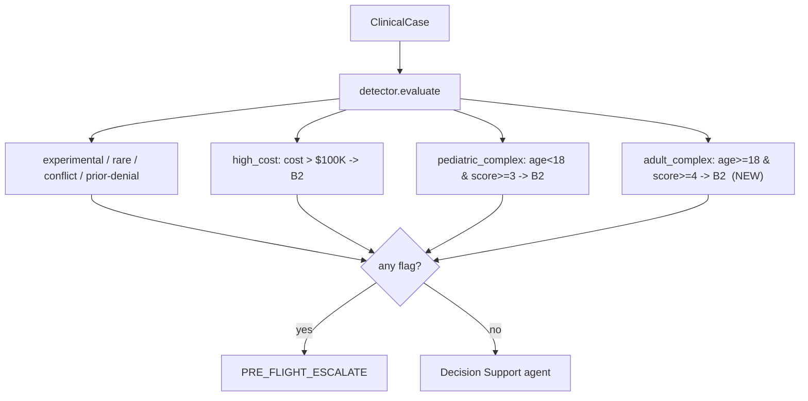

# iter-6 Design — "The harness learns to say no, carefully"

| Field | Value |
|---|---|
| Iteration | 6 |
| Iteration tag | `harness-iter-6` (created at close) |
| Base branch | `harness/iter-6` off `main` (`d0f807f`) |
| Previous tag | `harness-iter-5` |
| Base model | `claude-sonnet-4-5-20250929` |
| Design date | 2026-05-30 |
| Author | David Reed |
| Constraint levels touched | instrumentation, escalation_branch, evaluation_harness, long_term_memory |

## Thesis

iter-6 runs the literal iter-6 prediction recorded in `docs/ITERATIONS.md`
("What success looks like for iter-6") on the 20-case golden set, treating the
dataset-scaling track (GC-026+) as a separate workstream. Four changes at four
distinct constraint levels — the same breadth as iter-5 — ordered low-risk →
high-risk so each lands on a green suite before the next begins.

The unifying lesson across the two load-bearing changes: **move high-stakes
judgments from soft LLM discretion toward auditable structure.** chg-2 makes
adult complexity escalation *deterministic* instead of relying on the LLM's
self-assessed complexity. chg-4 gives institutional memory its first *deny*
pattern — criterion-gated, with hard IN_REVIEW fallbacks — instead of letting
denials emerge freely from the agent. Both reduce the surface where a
high-consequence decision depends on per-run model behavior.

## Scope boundary (explicit)

iter-6 is scoped to the **20-case golden set** for routing behavior. Two
deliberate crossings of that line, both called out so they are not silent:

1. **chg-3** adds a *parallel* eval list (`ADULT_COMPLEXITY_CASES`), leaving
   `GOLDEN_CASES` at exactly 20 — mirroring how iter-5 chg-2 added
   `PEDIATRIC_CASES`. The golden 20 is unmodified.
2. **chg-4**'s deny anchor `GC-034` lives in the **expansion** file
   `tests/clinical/denial_cases.py`, not the golden 20. The memory entry itself
   is dataset-independent (a prompt fragment); only its *live verification*
   reaches into expansion data. This is the one place iter-6 touches an
   expansion case, and it does so for verification only.

---

## chg-1 — `tracing.py` → structlog

- **Type:** improvement
- **Constraint level:** instrumentation (same as iter-5 chg-1)
- **PHI impact:** none · **Audit relevant:** false

### What / where
`src/pacca/config/logging.py` already configures structlog as the project's
logging backbone, and `src/pacca/integrations/vector_store.py:48` already uses
it. `src/pacca/config/tracing.py` is the lone stdlib-`logging` holdout. iter-5
chg-1 wrapped its calls in `extra={...}` as a stopgap and left a breadcrumb at
`tracing.py:116`: *"when the project standardizes on structlog, this can become
structlog.get_logger(__name__).info(...)."* This change cashes that in.

- Replace `import logging` / `logger = logging.getLogger(__name__)` with
  `from .logging import get_logger` / `logger = get_logger(__name__)`.
- Convert the 4 `logger.info/.warning(..., extra={...})` calls to native
  structlog kwargs (drop the `extra={}` wrapper).
- Delete the now-resolved "iter-future" comment.

### Why
Tech-debt closure with a clear trigger event (the iter-5 breadcrumb). Removes
the last divergent logging path so all structured logging flows through one
configured pipeline.

### Risk
Near-zero. structlog is already live elsewhere; no new dependency. No circular
import (logging.py imports only structlog; tracing.py imports only
OpenTelemetry; `get_logger` is a leaf). The `base.py` type-ignores
(`misc,unused-ignore` on tenacity `@retry`; `call-overload,unused-ignore` on the
Anthropic SDK `create()`) are **out of scope** — they are third-party stub
limitations, not structlog.

### Verification
Full suite green; manual confirmation that the no-op/console/OTLP tracing paths
still emit the same log events with their fields intact.

### Rollback
`git revert <sha>`. Restores the stdlib-logging + `extra={}` form.

---

## chg-2 — adult complexity pre-flight check

- **Type:** new (escalation branch)
- **Constraint level:** escalation_branch (same level as iter-3 chg-1 / iter-5 chg-3)
- **PHI impact:** none · **Audit relevant:** true
- **REQ trace:** PRD §5.4 Branch 2 (Medical Director / specialist review)

### What / where
Generalize the deterministic complexity model beyond pediatrics. Today
`_compute_complexity_score` (integer 1–5) drives only
`_check_pediatric_complex` (age `<18`, threshold 3). The adult threshold
`complexity_specialist_review_min=4` exists in `Settings` but is consumed only
by `ClassificationAgent`'s *soft, LLM-self-assessed* flag
(`classification_agent.py:184`) — never by a deterministic pre-flight.

- Add `EscalationReason.ADULT_COMPLEX` (`src/pacca/models/enums.py`, after
  `PEDIATRIC_COMPLEX`) with a docstring matching the enum's house style.
- Add `ClinicalRiskDetector._check_adult_complex(case, flags)` mirroring
  `_check_pediatric_complex`: gate on age `≥ PEDIATRIC_AGE_CUTOFF (18)`, read
  `case.complexity_score` else `_compute_complexity_score(case)`, fire when
  `score >= settings.complexity_specialist_review_min` (=4) → Branch 2.
- Wire into `evaluate()` immediately after `_check_pediatric_complex`.
- Add the `ADULT_COMPLEX → Branch 2` routing entry wherever the orchestrator
  maps `EscalationReason` to branches (a new enum member needs a mapping;
  exact site to be located during implementation).

### Why
Policy-grade escalation must be **deterministic and reproducible**, not left to
the LLM's per-run self-assessment. This is the same failure-pattern lineage as
iter-2 (cost rules pulled out of the agent prompt after the GC-010 silent
failure) and iter-3 (pediatric complexity moved to pre-flight). The
classification-agent complexity flag remains advisory; the pre-flight is
authoritative. The setting that named itself "specialist_review_min" finally
gates deterministic specialist-review escalation.

### Design choice — separate method, not a merged `_check_complexity`
The codebase keeps one named check per policy branch, 1:1 with the
`EscalationReason` enum (`_check_high_cost`, `_check_pediatric_complex`). A
merged age-branching method would be marginally more DRY but would *modify* the
iter-5 pediatric code (larger diff, higher regression risk) and collapse two
distinct audit reasons into one. Mirroring is the lower-risk, pattern-consistent
choice. **Considered and rejected.**

### Score behavior (no model change — reuse `_compute_complexity_score`)
Weighting is unchanged: age-extreme (`<18` *or* `>75`) +2, severity +0–3,
≥2 prior failures +1, comorbidity +1, clamped [1,5]. Consequences for the new
adult path:
- Adult **18–75** must clear a high bar — severe (+2) **and** ≥2 failures (+1)
  **and** comorbidity (+1) = 4 — to escalate. Deliberately high: adults are the
  default population; we do not want to over-escalate.
- **Elderly >75** + severe (+2 age, +2 severity) = 4 escalates appropriately.
- Mutually exclusive with the pediatric path by the age gate; no double-fire.

### Risk cases
The chg-3 adult cases (escalating + boundary). Regression watch: the existing
pediatric routing (GC-012, GC-023/024/025) must be untouched, and no golden-20
adult case that currently auto-approves may start escalating.

### Verification
New unit tests for `_check_adult_complex` (each threshold boundary, age gate,
structured-vs-parser score paths). Live clinical gate: the chg-3 escalating case
routes IN_REVIEW/B2 via `ADULT_COMPLEX`; the boundary case does not.

### Rollback
`git revert <sha>`. `complexity_score` field stays optional (no migration). The
`ADULT_COMPLEX` enum member and its orchestrator mapping revert together.

---

## chg-3 — justifying adult complexity eval cases

- **Type:** new (data + harness wiring)
- **Constraint level:** evaluation_harness (same as iter-5 chg-2)
- **PHI impact:** none (synthetic) · **Audit relevant:** false

### What / where
A pre-flight branch with no data behind it is an unfalsifiable assertion. New
file `tests/clinical/adult_complexity_cases.py` exporting
`ADULT_COMPLEXITY_CASES`, mirroring iter-5's `pediatric_cases.py` pattern — a
**parallel list, `GOLDEN_CASES` stays at 20.** Synthetic data only (HIPAA).

- **Escalating anchor:** adult 18–75, severe disease, ≥2 documented prior
  therapy failures, a comorbidity, estimated cost **< $100K** (so `high_cost`
  does not pre-empt), and no experimental/rare/conflict/prior-denial trigger →
  `_compute_complexity_score` = 4 → `ADULT_COMPLEX` → IN_REVIEW / Branch 2.
  Disease selection must avoid the high-cost biologics that already fire on
  cost (e.g. severe treatment-resistant COPD / resistant hypertension territory,
  not RA biologics).
- **Boundary "must-not-escalate" case:** adult, severe but no failures /
  comorbidity → score ≤ 3 → must **not** fire (mirror of iter-5's GC-023
  pediatric guard). Expect 2–3 cases total, as iter-5 did.
- Wire into the live clinical gate loop (`tests/clinical/test_clinical_accuracy.py`)
  and add the new module to the mypy hook `additional_dependencies` in
  `.pre-commit-config.yaml` if it surfaces untyped-decorator errors (iter-5
  chg-2 precedent).

### Why
Gives the chg-2 discriminator real data points across its input space — at least
one case that must escalate and one that must not — so the adult threshold is
empirically defended, not merely declared.

### Verification
Live gate routes each new case to its expected outcome; full suite green.

### Rollback
`git revert <sha>` removes the file and the gate wiring; the pre-iter-6 gate is
restored.

---

## chg-4 — first deny-pattern H2 memory entry (centerpiece)

- **Type:** new (institutional memory)
- **Constraint level:** long_term_memory (same level as iter-3/4/5 H2 entries)
- **PHI impact:** none · **Audit relevant:** true
- **Anchor case:** `GC-034` (off-label nivolumab for pancreatic adenocarcinoma,
  no NCCN compendia support) in `tests/clinical/denial_cases.py`.

### Why this is the riskiest change in the cycle
All three existing H2 entries are emphatically `NEVER to DENIED` — the memory
system's invariant has been that its shortcuts only auto-approve or fall back to
IN_REVIEW. This is the **first entry that encodes a DENIED outcome.** Its
failure mode — over-denial — is the one that actually harms patients (a wrongly
auto-denied therapy), unlike an approve entry whose worst case is an unnecessary
human review. The entire entry is built around guarding that failure mode.

### Anchor selection — GC-034 over GC-036 / GC-035
- **GC-034 (chosen):** a clean *clinical-guideline* denial (NCCN compendia
  absence) squarely in the DecisionSupportAgent's lane; no pre-flight
  interaction; and it **mirrors the very first memory entry** (NSCLC
  pembrolizumab — same NCCN oncology body, opposite verdict). The cleanest
  approve-mirror / deny-mirror narrative.
- **GC-036 (rejected):** re-request without new evidence — tangles with the
  Branch 7 prior-denial pre-flight (its own rationale says "Branch 7 would
  fire"); the memory entry would be redundant with / confused by the pre-flight.
- **GC-035 (rejected):** benefit-cap exhaustion is a *contractual* denial, not a
  clinical one — arguably not the clinical agent's call at all.

### Entry structure (inverts the approve-entry format)
1. **Headline deny-class:** off-label oncology biologic without NCCN compendia
   support.
2. **Required criteria for denial — ALL explicitly documented:** indication is
   off-label for the tumor type; NCCN compendia does not list it (no Cat
   1/2A/2B); no tissue-agnostic qualifier (MSI-high / TMB-high / NTRK) that would
   independently justify; not enrolled in a clinical trial; CMS NCD / commercial
   policy aligns (no compendia → no coverage).
3. **Anti-patterns that FLIP deny → IN_REVIEW (the over-denial guard):** *any*
   compendia listing (even Category 2B); *any* tissue-agnostic marker
   (MSI-high / TMB-high / NTRK fusion); active trial enrollment;
   ambiguous/missing compendia documentation; plausible expanded-access /
   compassionate-use context.
4. **Governing rule, stated explicitly:** any uncertainty → IN_REVIEW; **never
   auto-deny on doubt.** The agent must cite the *specific* compendia-absence
   basis and recommend the clinical redirect (trial enrollment) before a denial
   is valid.
5. **Interaction note:** does not override pre-flight checks; if any pre-flight
   fires, that routing wins.

`PROMPT_REGISTRY` DecisionSupportAgent **v2.5 → v2.6** in
`src/pacca/agents/prompts/templates.py`.

### Empirical-honesty note (fix vs. hardening)
Whether chg-4 *fixes* a wrong baseline answer or merely *hardens consistency*
depends on how the agent handles GC-034 today — unknown until the AHE
`--rollouts` baseline is captured. The runbook captures that baseline **first**;
the manifest reports fix-vs-hardening truthfully either way. No claim of "fixes
X" is made in advance of evidence.

### Tests (mirror `tests/unit/test_h2_memory_criterion_preservation.py`)
New test class(es) for the deny entry: injection / criterion-preservation /
**anti-pattern → IN_REVIEW** (the over-denial guards) / **regression that GC-005
(psoriasis step-therapy) still routes IN_REVIEW** and is not swept into deny.
Live verification: `GC-034` → DENIED with the cited compendia basis; an
off-label-*with*-compendia near-miss → IN_REVIEW; `GC-005` → IN_REVIEW.

### Risk cases
`GC-034` (must deny correctly), `GC-005` (must stay IN_REVIEW — the headline
over-denial guard), plus a synthetic off-label-with-compendia near-miss.

### Rollback
`git revert <sha>` removes the entry; `PROMPT_REGISTRY` reverts to v2.5; the
rendered memory section shrinks.

---

## Cross-cutting deliverables (per PACCA iteration workflow)

- **iter-5 verdict block:** the iter-6 manifest must carry keep/revise/drop
  verdicts on iter-5 chg-1..4, verifying the prior iteration held at iter-6 HEAD.
- **Iteration artifacts:** `harness/manifests/iter-6.json` (validates against
  `change_manifest.schema.json`), `RUNBOOK_iter6.md` (root), `docs/ITERATIONS.md`
  iter-6 narrative, `harness-iter-6` annotated tag, captured baseline.
- **Workflow:** branch-and-PR (not direct-to-main); pre-commit hooks run
  (no `--no-verify`); reviewer subagent before each commit; full suite green
  (capture the current passing count as the baseline at branch start) + live
  clinical gate before merge.
- **HIPAA:** synthetic data only in the new eval cases and the memory entry;
  deny rationales cite guideline bodies, never patient specifics; no PHI in
  logs/fixtures.

## Sequencing

1. chg-1 (instrumentation, ~zero risk) — establishes a clean green baseline.
2. chg-2 (adult pre-flight) — code + unit tests, no live data yet.
3. chg-3 (adult eval cases) — data that exercises chg-2 end-to-end.
4. chg-4 (deny memory entry) — highest risk, lands last on a proven-green suite;
   baseline captured before the entry is added.

## Success criteria

- All four changes merged via PR with the full suite + live clinical gate green.
- `ADULT_COMPLEX` escalates the chg-3 anchor and spares the boundary case,
  deterministically.
- The deny entry denies `GC-034` with a cited basis **and** leaves `GC-005` and
  the with-compendia near-miss at IN_REVIEW (no over-denial).
- iter-5 verdicts recorded; iter-6 manifest validates; `harness-iter-6` tagged.

## Considered and rejected

- **Merged `_check_complexity` method** (chg-2) — see chg-2 design choice.
- **Safe gate-pattern entry instead of a deny entry** (chg-4) — a step-therapy
  IN_REVIEW entry (GC-005 class) would be lower risk but methodologically a third
  repeat of the approve-entry pattern; it breaks no new ground. Rejected in
  favor of the deny entry, which is the novel capability test.
- **`docs/superpowers/specs/` spec location** — rejected to keep the AI-skill
  framework's fingerprints out of a portfolio exhibit of the AHE methodology;
  this spec follows PACCA's existing `docs/*_DESIGN.md` convention.
