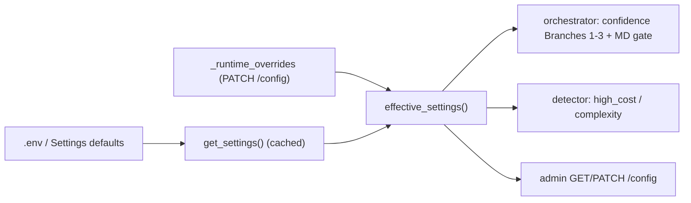

# Runtime-Tunable Decision Thresholds — Design

| Field | Value |
|---|---|
| Topic | Reconcile confidence routing: make all decision thresholds genuinely runtime-tunable |
| Design date | 2026-06-01 |
| Author | David Reed |
| Base branch | `feat/runtime-tunable-thresholds` off `main` (`00fa48f`) |
| Constraint levels touched | instrumentation (settings/config), escalation_branch (orchestrator routing), tool_implementation (admin route) |
| REQ trace | PRD §5.4 (confidence Branches 1–3 → auto-approve / Medical Director / human review) |
| PHI impact | none (config plumbing; no patient data) · **Audit relevant: true** (clinical decision parameters) |

## Thesis

PACCA exposes confidence-routing thresholds as tunable operational config, but
the values that actually drive routing are hardcoded in the orchestrator and
never read from settings. The admin API even promises "changes take effect
immediately for all subsequent requests" — a promise it cannot keep, because the
runtime-override store it writes to is read by nothing in the decision path.

This change makes the promise true: a single **effective-settings** accessor
merges runtime overrides over environment defaults, and every threshold consumer
(orchestrator, detector, admin) reads through it. Default values are set to
**preserve today's vetted 0.95 / 0.90 behavior exactly** — the reconciliation
fixes the *wiring*, not the *behavior*.

## Background — the current disconnect (verified)

Three independent facts establish the problem:

1. **The orchestrator hardcodes routing thresholds.** `agents/orchestrator.py`
   imports no settings and uses literals: Branch 1 `confidence >= 0.95`
   (`:176`), Branch 2 `0.90 <= confidence < 0.95` (`:194`), Branch 3
   `confidence < 0.90` (`:214`), and the Medical-Director post-review gate
   `>= 0.95` (`:335`).
2. **The detector already does it right.** `agents/clinical_risk_detector.py`
   reads its thresholds live from settings: `high_cost_threshold` via
   `get_settings()` (`:654`) and `complexity_specialist_review_min` (`:760`).
   The orchestrator is the lone outlier.
3. **Admin runtime overrides reach nothing.** `api/routes/admin.py` holds a
   module-level `_config_overrides` dict and an `_effective()` helper; `GET/PATCH
   /config` read/write it and the PATCH docstring promises immediate effect. But
   `_config_overrides` is read **nowhere outside `admin.py`**, so a PATCH changes
   only the echoed config — not routing. This is true for `high_cost` /
   `complexity` too (they read raw `get_settings()`, which is env-only and
   override-blind), not just confidence.

Net: there are two disconnected sources of truth (hardcoded literals vs.
`Settings`) and a runtime-override surface wired to nothing.

## Decision summary

- **Scope:** make all decision thresholds genuinely runtime-tunable (confidence
  *and* the already-config-driven high_cost / complexity), so `PATCH /config`
  takes effect in routing.
- **Approach A** (chosen): a shared `effective_settings()` accessor in `config/`.
- **Values:** preserve **0.95 / 0.90** — set the `Settings` + `.env` defaults to
  match today's hardcoded behavior. No behavior change with no overrides active.
- **Governance:** every runtime override writes a HIPAA audit-trail entry.

## Design

### 1. Effective-settings accessor (`config/settings.py`)

Move the override store and its validation out of `admin.py` into `config/`,
beside `get_settings()`, and add:

```python
# config/settings.py
_runtime_overrides: dict[str, object] = {}

def effective_settings() -> Settings:
    """get_settings() with runtime overrides applied. Cheap; call per request."""
    base = get_settings()
    if not _runtime_overrides:
        return base
    return base.model_copy(update=_runtime_overrides)

def set_override(field: str, value: object) -> None: ...   # writes _runtime_overrides
def clear_override(field: str) -> None: ...
def active_overrides() -> dict[str, object]: ...           # for GET /config
```

- `model_copy(update=...)` yields a fresh, fully-typed `Settings` view per call.
  Field-bound validation happens at **write time** (the PATCH request model +
  the `auto > escalation` invariant), so a read-time copy is safe.
- `get_settings()` keeps its `@lru_cache` singleton contract **unchanged** — we
  layer overrides on top rather than mutating the cached base. This is why
  Approach A beats making `get_settings()` itself override-aware.

### 2. Consumers



- **Orchestrator:** import `effective_settings`; replace the four literals
  (`:176/194/214/335`) with `s.auto_approve_confidence_threshold` (0.95) and
  `s.escalation_confidence_threshold` (0.90), reading `s = effective_settings()`
  once per `evaluate()`. The two settings map exactly onto the two boundary
  values — Branch 1 `>= auto_approve`, Branch 2 `escalation <= c < auto_approve`,
  Branch 3 `c < escalation`, MD gate `>= auto_approve`.
- **Detector:** swap the two `get_settings()` reads (`:654, :760`) to
  `effective_settings()` so `high_cost` / `complexity` overrides also take effect.
- **Admin:** `GET/PATCH /config` use the shared `config/` store/accessor instead
  of the private `_config_overrides` / `_effective`. The `auto > escalation`
  invariant moves into `config/` so it is enforced on **every** override path
  (not only the HTTP route); the retry-bounds check may stay in admin or move
  too — implementation's call.

### 3. Defaults — preserve behavior

| Setting | Today (unused by routing) | New default |
|---|---|---|
| `auto_approve_confidence_threshold` | 0.85 | **0.95** |
| `escalation_confidence_threshold` | 0.75 | **0.90** |

Changed in `config/settings.py` (`Field(default=...)`), `.env`, and
`.env.example`. With no overrides, routing is byte-identical to current `main`.
`enums.py:70` ("confidence < 0.90") and the iter-6 SVGs
(`decision_trace.svg`, `architecture_v2.4.svg`) remain accurate — **no asset
edits needed.**

### 4. Governance — audit the knob

Threshold changes are clinical-policy changes. On every applied override, write
an audit-trail entry (`AuditRepository`) — `action="config_threshold_overridden"`,
actor = the admin principal, `details={field, old, new}` — in addition to the
existing `config_override_applied` structlog line. This gives a durable,
queryable record of who changed a decision boundary and when.

## Considered and rejected

- **Approach B — dependency-inject a settings snapshot** threaded
  orchestrator→detector. More explicit, but a larger refactor that abandons the
  established inline-`get_settings()` pattern the detector already uses. Rejected:
  churn out of proportion to the fix.
- **Approach C — make `get_settings()` override-aware.** Fewest call-site edits,
  but `get_settings()` is `@lru_cache`'d; blending a cached singleton with mutable
  runtime overrides changes its contract for every existing caller. Rejected:
  highest blast radius.
- **Adopt 0.85 / 0.75 as effective values.** Would loosen the auto-approve bar
  (0.95→0.85) — more autonomous approvals, fewer Medical-Director/human reviews.
  A real clinical change that was never actually exercised by routing. Rejected:
  out of scope here; if desired it is a separate, deliberately re-baselined
  clinical decision.

## Risk & safety

- **Primary safety gate:** the golden-20 clinical gate must stay green at the new
  defaults. Because defaults reproduce 0.95/0.90 and no test sets overrides, the
  routing path is unchanged — the gate is a regression check, not a re-baseline.
- **Concurrency:** `_runtime_overrides` is a process-local dict mutated by PATCH
  and read by request handlers under a single asyncio loop (same exposure as the
  existing `_config_overrides`). No new sharing model introduced.
- **Validation:** invalid overrides are rejected at PATCH write-time (Field
  bounds + `auto > escalation`); reads never see an invalid state.

## Verification

- **Unit:** `effective_settings()` returns the base when no overrides and the
  merged view when an override is set; the orchestrator routes a synthetic 0.93
  case to Medical Director at defaults, and an override to
  `auto_approve=0.92` flips that same case to auto-approve (proves the wire);
  the detector escalates a case when `high_cost_threshold` is overridden below
  its cost; defaults assert exactly 0.95 / 0.90.
- **Integration:** `PATCH /config {auto_approve_confidence_threshold: …}` →
  a subsequent decision request reflects the new boundary; `GET /config` echoes
  the active override; the `auto <= escalation` PATCH is rejected 422 (existing
  test preserved); an audit entry is written on override.
- **Regression:** full `make test` green; **golden-20 live clinical gate green
  at defaults** (capture the passing count at branch start as the baseline).

## Files changed

`config/settings.py` (accessor + store + defaults), `.env`, `.env.example`,
`agents/orchestrator.py` (4 literals → effective settings + import),
`agents/clinical_risk_detector.py` (2 reads → effective settings),
`api/routes/admin.py` (use shared store; move validation; add audit write),
tests (orchestrator routing, effective-settings, admin integration, defaults).
**No SVG/doc edits** — values are preserved.

## Out of scope (flagged, not addressed here)

- `complexity_auto_approve_max` appears unread by decision logic — a separate
  cleanup, not part of this change.
- The `api/database.py` SQLite-vs-Postgres `users`-table bug (documented by the
  untracked `_init_users.py` workaround) is unrelated.

## Rollback

`git revert <sha>` restores the hardcoded literals and the env-only,
override-blind reads. The `Settings` fields remain (they predate this change);
only their defaults and consumers revert.

## Process

Branch-and-PR (`feat/runtime-tunable-thresholds` → `main`); pre-commit hooks run
(no `--no-verify`); `reviewer` HIPAA/security subagent before each commit; full
suite + live clinical gate green before merge.
