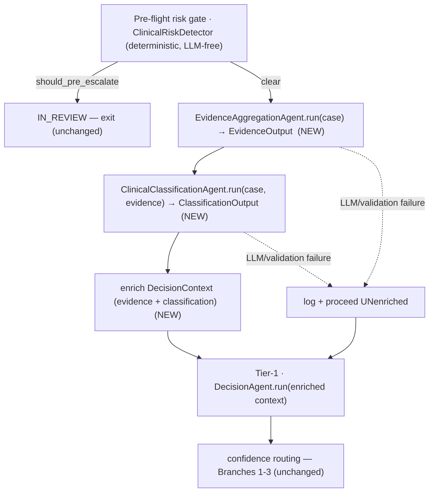

# Evidence → Classification Triage Pipeline — Design

| Field | Value |
|---|---|
| Feature | Rebuild `EvidenceAggregationAgent` + `ClinicalClassificationAgent` against the current architecture and wire them in as **advisory enrichment** (the PRD "Triage Coordinator") |
| Design date | 2026-06-03 |
| Author | David Reed |
| Base branch | `feat/triage-pipeline` off `main` (`355b047`) |
| Integration model | **Option A — advisory enrichment** (runs after pre-flight, before Tier-1; informs, does not control) |
| REQ trace | PRD "Clinical Classification Agent" / Evidence→Classification→Decision flow; SDD **C5. ClinicalClassificationAgent Contract** |
| PHI impact | none new — the new agents read the same `ClinicalCase` the `DecisionAgent` already consumes; synthetic data in tests. **Audit relevant: true** (new agent decisions logged). |
| Decision records | [ADR-015..019](./ENGINEERING_DECISIONS.md) |
| Constraint levels touched | agent_implementation (two new agents), orchestration (pipeline wiring), model layer (one enum + two output models + one context extension) |

## Thesis

The PRD/SDD specify a two-step pre-decision triage — `EvidenceAggregationAgent` synthesizes the case into a clinical narrative, then `ClinicalClassificationAgent` scores complexity, identifies specialty, and assesses urgency "to determine routing path." Both agents exist in the repo but are stranded against an **obsolete architecture vintage** and cannot even import. This design **rebuilds both against the current architecture** (`ClinicalCase` + the real `BaseAgent.execute()`) and wires them into the orchestrator as **advisory enrichment**: they run after the deterministic pre-flight gate, before Tier-1, and their outputs enrich the `DecisionAgent`'s prompt + the audit trail — **without taking control of routing** (which stays with the existing deterministic logic and the detector's authoritative complexity gate).

This is a deliberate behavioral **enhancement**, not a behavior-neutral change: feeding the `DecisionAgent` a synthesized narrative + a classification changes its inputs and will likely move some decisions. The golden-20 live gate is therefore a **re-baseline**, not a preservation check ([ADR-019](./ENGINEERING_DECISIONS.md)).

## Background — why rebuild, not repair

The current `classification_agent.py` / `evidence_agent.py` were written against an older, more abstract design: a rich nested `AuthorizationRequest`, a `BaseAgent` with `_call_llm` / generics / agent-chaining hooks, and models never built (`ClassificationResult`, `UrgencyLevel`, `AgentType`, `ClinicalEvidence`, …). The codebase then refactored to a simpler contract (`ClinicalCase` + `BaseAgent.execute(user_input, response_model)`), leaving these agents broken — they fail to import (PEP-695 generics in `agents/types.py` raise `SyntaxError` on Python 3.11). Repairing the imports would mean resurrecting obsolete machinery — a much larger, unjustified change ([ADR-015](./ENGINEERING_DECISIONS.md)). **Salvageable:** the prompts (`EVIDENCE_AGENT_SYSTEM`, `CLASSIFICATION_AGENT_SYSTEM`, `build_evidence_prompt`, `build_classification_prompt` all exist and are tested) and the *field concepts* of the old output models.

## Architecture — the advisory pipeline



The deterministic pre-flight gate is unchanged and stays authoritative; triage runs only on cases that clear it; routing is unchanged.

## Components

### 1. Models (one enum + two output models + one extension)

- **`UrgencyLevel`** (new enum in `models/enums.py`, exported from `models/__init__.py`): `ROUTINE | EXPEDITED | URGENT`.
- **`EvidenceOutput`** (new pydantic model in `models/triage.py`, exported from `models/__init__`): `clinical_narrative: str`, `key_findings: list[str]`, `evidence_gaps: list[str]`, `confidence_score: float (ge=0, le=1)`.
- **`ClassificationOutput`** (rewritten, slimmed, also in `models/triage.py`): `complexity: int (ge=1, le=5)`, `complexity_factors: list[str]`, `primary_specialty: str`, `urgency: UrgencyLevel`, `routing_rationale: str`, `confidence_score: float (ge=0, le=1)`.
  - `complexity` is an **integer 1-5**, consistent with the detector's `_compute_complexity_score` and the SDD — **not** the existing 4-level `ComplexityLevel` enum (they measure different things; see *Complexity overlap*). `primary_specialty` is a **string** (per the SDD's `"oncology"`-style values), avoiding coupling to the un-exported `ClinicalSpecialty` enum. The old `requires_specialist_review` / `requires_medical_director` booleans are **dropped** — they implied routing power this design does not grant.
- **`DecisionContext`** (extend, in `decision.py`): add `evidence: EvidenceOutput | None = None` and `classification: ClassificationOutput | None = None`. Optional + defaulted, so existing constructions are unaffected.

### 2. Agents (rewritten — mirror `DecisionAgent` exactly)

Both replace the dead file's contents and subclass the **real** `BaseAgent`, implementing `name` + `system_prompt` properties and a `run()` that builds a `user_input` string and calls `self.execute(user_input=..., response_model=...)` — the identical pattern `DecisionAgent.run()` uses.

- **`EvidenceAggregationAgent(BaseAgent)`** — `name = "EvidenceAggregationAgent"`; `system_prompt` returns the existing `EVIDENCE_AGENT_SYSTEM`; `run(context: DecisionContext) -> EvidenceOutput` builds `user_input` from the case (via the existing `build_evidence_prompt`, or the case JSON) and calls `execute(..., response_model=EvidenceOutput)`.
- **`ClinicalClassificationAgent(BaseAgent)`** — `name = "ClinicalClassificationAgent"`; `system_prompt` returns `CLASSIFICATION_AGENT_SYSTEM`; `run(context: DecisionContext, evidence: EvidenceOutput) -> ClassificationOutput` builds `user_input` from the case + the evidence narrative and calls `execute(..., response_model=ClassificationOutput)`.

The new files import only `BaseAgent`, the prompt assets, and their output model from `models/triage.py` — **not** `agents/types.py`. (The output models live in `models/`, a leaf below `agents/`, so `decision.py`'s `DecisionContext` and the agents both import them with no circular import — the same reason `AuthorizationDecision` lives in `models/`.)

### 3. Orchestrator integration (`process_decision`)

- `__init__`: add `self.evidence_agent = EvidenceAggregationAgent()` and `self.classification_agent = ClinicalClassificationAgent()`.
- Insert the triage step at `orchestrator.py:~147` — **after** the pre-flight escalation `return`, **before** the Tier-1 timing/audit:
  ```python
  # ── Triage enrichment (advisory; PRD Evidence → Classification) ──────────
  evidence, classification = await self._run_triage(context, audit, correlation_id)
  if evidence is not None and classification is not None:
      context = context.model_copy(update={"evidence": evidence, "classification": classification})
  ```
  `_run_triage` runs both agents with `agent_evidence_started/completed` and `agent_classification_started/completed` audit pairs (mirroring the existing decision audit), and returns `(None, None)` on any failure (see *Resilience*).
- **`DecisionAgent.run()`**: fold the triage context into `user_input` **only when present** (None-guarded), so a bare `DecisionContext` (existing tests, or a degraded run) yields byte-identical behavior to today:
  ```python
  triage = ""
  if context.classification is not None:
      triage += f"## Triage Classification\n{context.classification.model_dump_json(indent=2)}\n\n"
  if context.evidence is not None:
      triage += f"## Evidence Summary\n{context.evidence.clinical_narrative}\n\n"
  user_input = f"{triage}## Clinical Case\n{context.case.model_dump_json(indent=2)}\n\n## Relevant Clinical Guidelines\n{context.relevant_guidelines}"
  ```

### 4. Resilience — advisory must never break the decision

`_run_triage` wraps both agent calls; on any exception (LLM error, output-validation failure) it logs (audit + structlog) and returns `(None, None)`. The orchestrator then proceeds to Tier-1 with the **un-enriched** context — i.e., today's behavior. Triage is best-effort enrichment, never a hard dependency of the safety-critical decision path.

### 5. `types.py` disposition

After the rewrite, neither new agent imports `agents/types.py` (they use the `DecisionAgent` pattern, not `AgentContext`). The plan verifies nothing else imports it; if dead, **delete** `types.py` (resolving its PEP-695 syntax bug + the missing `AgentType`/`AgentAutonomyLevel` enums by removal, not repair — [ADR-018](./ENGINEERING_DECISIONS.md)). If a live module still imports it, apply only the minimal `Generic[T]` syntax fix.

## Complexity overlap (documented)

The detector's `_compute_complexity_score` (deterministic integer 1-5) gates pre-flight and is **authoritative** for escalation (`PEDIATRIC_COMPLEX` / `ADULT_COMPLEX`). The classification agent's `complexity` (LLM, 1-5) is **advisory** context for the `DecisionAgent` + audit. They may diverge; that is expected and acceptable — the deterministic gate has already fired (or not) *before* classification runs, and the classification score never re-opens it. (`ClinicalCase` also carries an optional structured `complexity_score`; classification does not write it.)

## Considered & rejected

- **Resurrect the obsolete vintage** (rich `AuthorizationRequest`, abstract `BaseAgent`, `AgentContext` chaining) — [ADR-015/018](./ENGINEERING_DECISIONS.md).
- **Option B** (classification replaces detector complexity — puts an LLM inside the deterministic safety gate) / **Option C** (triage routing — LLM can short-circuit the pipeline) — [ADR-016](./ENGINEERING_DECISIONS.md). C is a possible future iteration.
- **Map `complexity` to the 4-level `ComplexityLevel` enum** — the SDD + detector use integer 1-5; an integer is simpler and avoids a lossy mapping. `ComplexityLevel` is untouched for code that uses it.
- **Hard-fail the decision when triage fails** — advisory must degrade gracefully.

## Risk

- **Behavioral (primary).** Enriching the `DecisionAgent` changes its inputs → golden-20 scores may move. *Mitigation:* re-baseline ([ADR-019](./ENGINEERING_DECISIONS.md)); evaluate movement case-by-case; a regression triggers a decision (adjust prompt framing vs. accept). Gated behind the live clinical gate before merge.
- **Latency/cost.** +2 LLM calls per case that clears pre-flight (~+1s, ~+$0.02/case). Pre-flight-escalated cases skip triage entirely (they exit first).
- **Resilience.** Covered by graceful degradation (§4).

## Verification

- **Unit.** Each agent's `run()` with a mocked `execute`/client returns the typed output; `UrgencyLevel` + both output models validate (range bounds); `DecisionContext` carries the new fields; `DecisionAgent.run()` folds triage when present **and is byte-identical when absent** (the latter proven by the existing `DecisionAgent` tests continuing to pass).
- **Integration** (orchestrator, mocked agents). `process_decision` runs evidence+classification, enriches the context, and the `DecisionAgent` receives them; a forced triage failure still completes the decision (graceful degradation); audit pairs are logged.
- **Regression.** `make test` green; existing decision/orchestrator tests unaffected (enrichment is None-guarded).
- **Re-baseline.** Golden-20 live clinical gate (`make test-clinical`) — run, record the new distribution, evaluate movement vs. the pre-change baseline (improvement/neutral expected; investigate any regression).

## Phasing (single implementation plan)

1. **Foundation** — `UrgencyLevel` enum + export; `EvidenceOutput` + `ClassificationOutput` models; `DecisionContext` fields. Unit tests.
2. **`EvidenceAggregationAgent`** — replace the dead file; unit tests (mocked LLM).
3. **`ClinicalClassificationAgent`** — replace the dead file; unit tests.
4. **Orchestrator wiring** — `_run_triage` + insertion + `DecisionAgent.run()` enrichment; integration + graceful-degradation tests.
5. **`types.py` cleanup** — delete if dead (verify); prompt-registry sanity.
6. **Gate** — `make test` + golden-20 **re-baseline**.

## Out of scope (flagged)

- **Full triage routing (Option C)** — agents stay advisory; a future iteration could let classification drive routing.
- **SDD URGENT-not-standard-queue postcondition** — the current orchestrator has no queue/priority concept; urgency is *recorded* (advisory) but does not yet drive queuing.
- **The rich `AuthorizationRequest` / `AgentContext` / chaining machinery** — not revived.

## Process

Branch-and-PR (`feat/triage-pipeline` → `main`); pre-commit hooks (no `--no-verify`); `reviewer` subagent before each commit; full suite + golden-20 **re-baseline** gate before merge.
